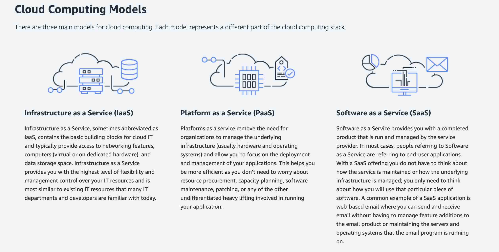
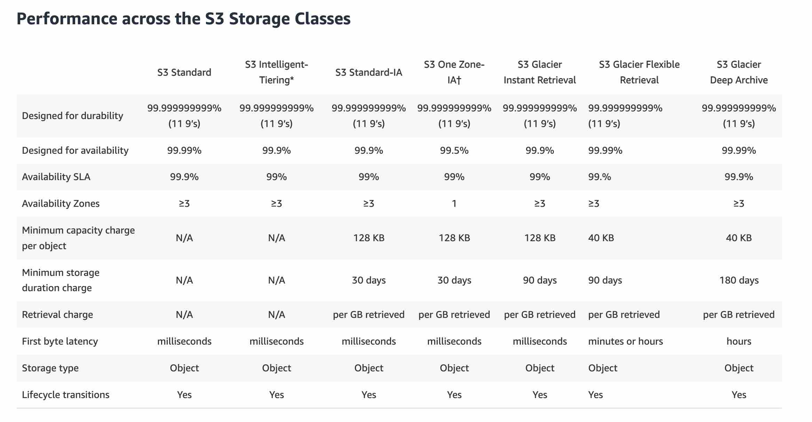
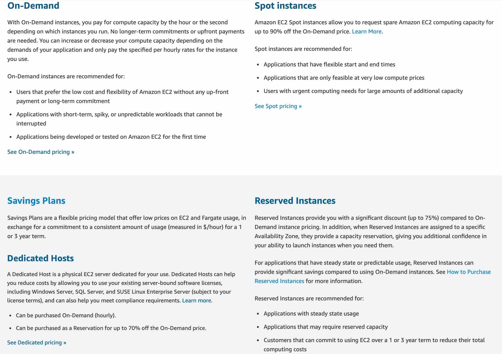
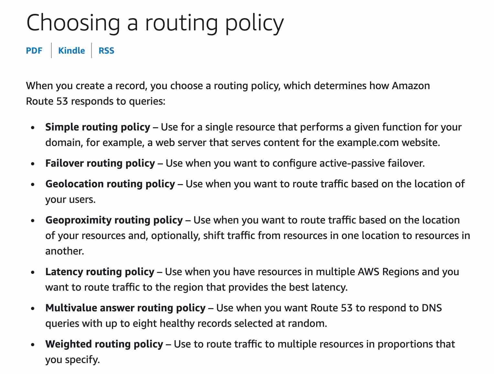

<!--
*** Thanks for checking out the Best-README-Template. If you have a suggestion
*** that would make this better, please fork the repo and create a pull request
*** or simply open an issue with the tag "enhancement".
*** Don't forget to give the project a star!
*** Thanks again! Now go create something AMAZING! :D
-->

<!-- PROJECT SHIELDS -->
<!--
*** I'm using markdown "reference style" links for readability.
*** Reference links are enclosed in brackets [ ] instead of parentheses ( ).
*** See the bottom of this document for the declaration of the reference variables
*** for contributors-url, forks-url, etc. This is an optional, concise syntax you may use.
*** https://www.markdownguide.org/basic-syntax/#reference-style-links
-->
[![Contributors][contributors-shield]][contributors-url]
[![Forks][forks-shield]][forks-url]
[![Stargazers][stars-shield]][stars-url]
[![Issues][issues-shield]][issues-url]
[![MIT License][license-shield]][license-url]
[![LinkedIn][linkedin-shield]][linkedin-url]

<!-- PROJECT LOGO -->
 

  

  <h3 align="center">Best-README-Template</h3>

  

    An awesome README template to jumpstart your projects!
     
    <a href="https://github.com/othneildrew/Best-README-Template"><strong>Explore the docs »</strong></a>
     
     
    <a href="https://github.com/othneildrew/Best-README-Template">View Demo</a>
    ·
    <a href="https://github.com/othneildrew/Best-README-Template/issues">Report Bug</a>
    ·
    <a href="https://github.com/othneildrew/Best-README-Template/issues">Request Feature</a>
  

<!-- TABLE OF CONTENTS -->

  
Table of Contents

  <ol>
    <li>
      <a href="#about-the-project">About The Project</a>
      <ul>
        <li><a href="#built-with">Built With</a></li>
      </ul>
    </li>
    <li>
      <a href="#getting-started">Getting Started</a>
      <ul>
        <li><a href="#prerequisites">Prerequisites</a></li>
        <li><a href="#installation">Installation</a></li>
      </ul>
    </li>
    <li><a href="#usage">Usage</a></li>
    <li><a href="#roadmap">Roadmap</a></li>
    <li><a href="#contributing">Contributing</a></li>
    <li><a href="#license">License</a></li>
    <li><a href="#contact">Contact</a></li>
    <li><a href="#acknowledgments">Acknowledgments</a></li>
  </ol>

<!-- ABOUT THE PROJECT -->
## Intro What is Cloud Computing?

Es on-demand delivery de compute power, database storage, apps and others
pay as you go procing, provisionando exactamente el tipo correcto y el tamano adecuado de recursos que necesitas.
Se peude acceder a muchos servicios que se necesita al instante
Manera sensible de acceder a servidores, almacenamiento, database y un set de aplicaicones y servicios

AWS tiene y maniene una red conectada de hardware para todo tipo de aplcaciones, mientras nosotros provisionamos y utilziamos lo que se necesita a traves de la web app.

nos olvidamos de provlemas como el pago del lugar de data center, provision de energia enfriamiento mantenimiento , mantenimiento, escalamiento y manejo contra desastres

### Modelos de despliegues de la Nube

Private Cloud
* Usado por solo una org
* Control completo
* Securidad para apps sensitivas
* cumple necesidades especificas

Public Cloud
* cloud resources owned y operado por a 3rd party cloud service provider y entregado a travez de interner
* Six adventages

Hybrid Cloud
* Mantiene unos servers en las instalaciones y amplie algunas capacidades
* Control sobre activos sensibles en la infraestuctura privada
* Flexibilidad y rentabidildad en la nuve publica 

### Five characteristics of cloud computing

* On demand self service
* Broad network access  accessible by diverse client plataforms
* Multi-tenacy and resource pooling (Tenencia múltiple y agrupación de recursos)
* Rapid elasticity and scalability
* Measured service

### 6 adventages of Cloud computing
* Trade capital expense CAPEX for operational expense OPEX Pay on demand , reduce TCO total cost of ownership and operational expense
* Benefit from massive economies scale(prices reduced as aWS is more efficient)
* Stop guessing capacity (adivinar) Scale based on actual measured usage
* Increase speed and agility
* Stop spending money running and mainaining data centers
Go global in minutes (leverage-aprovecha-the AWS global infra)

### Problems Solved by the cloud
* Flexibility change the resource when you needed
* Cost*effectiveness pay as you go
* Scalability accomodate larger loads adding nodes or increase HW
* Elasticiy ability to scale out (horitzontal )and sacle in (vertical )when needed
* High availabiliy and fault-tolerance build acrross data center
* Agility rapidly develop test and launch apps

### Types of Cloud Computing
* IaaS 
    Provee componetes basicos para cludTI en la nube
    networking computeres data storage
    Hghest level of flex
* PaaS
    Removes la necesidad de adminitras la infraestructura subaciente enfocado en el despliegue de apps
* SaaS
    Cproducto ejecutado y manejado por el proveedor

On-premises propias instalaciones

### Ejemplos de tipos de Cloud computing

* IaaS
    EC2, Azure,Digital Ocean 
* PaaS
    Elastic Beanstalk, Heroku Google App Engie
* SaaS
    Rekoginition, Gmail, Zoom

### Pricing of the Cloud

AWS has 3 pricing fundamentals fllowing the pay-as-you go pricing model

* Compute : pay for compute time
* Storage: Pay for data stored in the Cloud
* Data transfer OUT of the Cloud: data in is free
 
### AWs cloud history
2002 intenally launched

47% of the market in 2019
9 years leader
+1.000.000 active users

### AWS Cloud Use Cases
AWS permite crear sophisticated scalable applications applicable a dicersas industrias

### AWS Global Infraestructure 

* **AWS Regions**:
AWS tiene el concepto de Región, que es una ubicación física en todo el mundo donde agrupamos los centros de datos. Llamamos a cada grupo de centros de datos lógicos una zona de disponibilidad. Cada región de AWS consta de zonas de disponibilidad múltiples, aisladas y separadas físicamente dentro de un área geográfica.
Cluster of data centers, los servicios estan focalizados en regiones ,Names can be us-east-1, eu-west-3 

Para elegir una region se debe toamr en cuenta Compliance with data governance, proximity, available services with a Region, Pricing pricing varies region to region

* **Availability Zones**
Una zona de disponibilidad (AZ) es uno o más centros de datos discretos con energía, redes y conectividad redundantes en una región de AWS. Los AZ brindan a los clientes la capacidad de operar aplicaciones y bases de datos de producción que tienen mayor disponibilidad, tolerancia a fallas y escalabilidad de lo que sería posible desde un solo centro de datos. Todas las zonas de disponibilidad en una región de AWS están interconectadas con redes de baja latencia y gran ancho de banda, a través de fibra metropolitana dedicada totalmente redundante que proporciona redes de alto rendimiento y baja latencia entre las zonas de disponibilidad. Todo el tráfico entre AZ está encriptado. El rendimiento de la red es suficiente para lograr la replicación síncrona entre zonas de disponibilidad. Las zonas de disponibilidad facilitan la creación de particiones para aplicaciones de alta disponibilidad
Usually 3 min 2 max 6 , each AZ is one or more discrete data center with redundant power networking and connectivity
Isolated for disaaster
* **Local Zones**
Las zonas locales de AWS colocan la computación, el almacenamiento, la base de datos y otros servicios selectos de AWS más cerca de los usuarios finales. Con AWS Local Zones, puede ejecutar fácilmente aplicaciones muy exigentes que requieren latencias de milisegundos de un solo dígito para sus usuarios finales, como creación de contenido multimedia y de entretenimiento, juegos en tiempo real, simulaciones de depósitos, automatización de diseño electrónico y aprendizaje automático.

* **AWS Wavelength**
AWS Wavelength permite a los desarrolladores crear aplicaciones que brindan latencias de milisegundos de un solo dígito a dispositivos móviles y usuarios finales. Los desarrolladores de AWS pueden implementar sus aplicaciones en Wavelength Zones, implementaciones de infraestructura de AWS que integran los servicios de computación y almacenamiento de AWS dentro de los centros de datos de los proveedores de telecomunicaciones en el borde de las redes 5G y acceder sin problemas a la variedad de servicios de AWS en la región. Esto permite a los desarrolladores ofrecer aplicaciones que requieren latencias de milisegundos de un solo dígito, como juegos y transmisión de video en vivo, inferencia de aprendizaje automático en el borde y realidad aumentada y virtual (AR/VR). AWS Wavelength lleva los servicios de AWS al borde de la red 5G, minimizando la latencia para conectarse a una aplicación desde un dispositivo móvil

* **AWS Outposts**
bring native AWS services, infrastructure, and operating models to virtually any data center, co-location space, or on-premises facility. You can use the same AWS APIs, tools, and infrastructure across on-premises and the AWS cloud to deliver a truly consistent hybrid experience

-------Page 35----

### How to choose AWS Region?

* Compliance with data governance and legal requirements
* Proximity to customers reduce latency
* Available services with a regio new services accordin region
* Pricing priceing varies region

### shared responsibility Model diagram

Customer Responsability for the security in the Cloud
AWS for the security of the cloud

### AWS acceptable use poicy

* No illegal harmful 
* No security violations
* No network abuse
* No e-mail or other message abuse

## IAM 

* IAM idendtiyy and access management, Global service
* Root  account created by default shuldn't used or shared
* User are peopol within your organization and can be grouped
* Groups only contain users no other groups

Users pueden pertenecer o no a un grupo o a multiples

### IAM permissions

* Users or groups can be assigned JSON documents called policies
* Policies define permissions of the users
* AWS apply least privilege principle , dont give more permissions than a user need

* Strong passwords higher security for your account 
* in aws you can setup a password policy(length, include char, re-use, rquire change )

### Multi Factor Authentication MFA

protecto you account Root
MFA password +security device
DEvices:
* MFA virtual device (google auth , authy)
* Universal 2nd Factor (U2F) Securityy key (YubiKey)
* Hardware key gemalto
* hardware for AWS GovCloud SurePassID

### How can access users?

Access keys are generated through AWS Console, user can manage dont share , access key ID username Secret access key password

- CLI AWS command line interface -access keys

a tool enables you to interact with AWS services using commands in you command-line shell, direct access to the public APIs
Open source
Alternantive to using Console

- SDK Software Developer Kit -access keys
lenguage-specific APIs set of libreries, access AWS service programm, embedded with your app(JS, py,go)
CLI is built on aws sdk for py

- Console pass+MFA

### IAM Roles for Services

Some AWS service will need to perform actions on your behalf(en mi nombre), to do so, we'll assign permision to AWS services with IAM Roles Common roles(EC2 instance rroles;lambda, Cloudformation)

### Tools
 * credentials Report account-level Report that lists all accounts and users status

 * access advisor user-level Access advisor shows the service permissions and when those services were last accessed

 ### best Practices

 * Don't use the root account except for AWS account setup
 * One physical user = One AWS user
 * Assign users to groups and permission to croups
 * Create a strong pass policy
 * Use and enforce MFA
 * Create and Roles for giving permissions
 * Use Access keys for prog access (CLI/SDK)
 * Audit permissions of your account wiht IAM cred Report
 * Neverr share IAM users and access keys

### shared responsavility

* AWS infra, config and vulnerability, compliance
* YOU User, groups,MFA, rotate allf your keys, use IAM tools to apply permisions, analyse access patterns 

--P57---
## AMAZON EC2 

one of the mos popular, Elastic compute cloud IaaS
* Renting virtual machines EC@
* Storing data EBS
* Distribuiting load ELB
* Scaling the service auto-scaling group ASG
* EC@ is fundamental to undestand how cloud works
 
 ### Options
 * Operating System OS, CPU,RAM, 
 * Storage SPACe (-networ attached EBS EFS -hardware EC2 isntance store)
* Network card(speed of the card)
* Firewall rules(security group)
* Bootstrap script

* Its possible to boot our intance using a EC2 userd data script (lunch commands when machine start) only run one time when starts
* Used to automate tasks as update isntall softwaare download file
* Runs with the root user

### EC2 Instances Types Overview
Instances can be optimased for diferente use cases
AWS has this convention:

M5.2xlarge

m:instance class
5:generation
2xlarge: size within the insance class

* T (T2,t3,t4g,m5,m5a,m4) gernal pupose EC2 instance balance in compute memory and networking
* C (c6g,c5,c5a)computed Optimzed used for compute-intensive tasks that require hig preformace processos
* R (r6g,r5,r5n,x1,x1e)Memory Optimized fast performance for workloads that process large data sets in memory (hig perfomance for realtional no relational databeses optimez for by)
* I I3 D2 D3 Storage Optimized great for storage intensive task (high freq online transaction, cache for in-memory databases data warehousing)

### Security groups

Sec groups are the fundamental of network security in AWS, control how traffic is allowin into our EC2 instance, only contain allow rules, and can reference by IP or by security group.
Acting as a firewall on EC@ instances , regulate Access ports, authorised Ip ranges, control of inbound net and outbound

* Security groups can be attached to mulple insances, locked down to a region/
* Lives putside the EC2 intances, iof is blocked EC2 dont see it
* Good to maintaina separate SSH group to access
* If your app is not accessible (time out)its a sec group issue
* Connection refused its a app error 
* All inbound blocked by default
* All outbound authorised by default

Ports to remember SSH(secure shell) 22 FTS 21 SFTP (upload using secure ftp)22 HTTP 80 HTTPS 443 RDP remote desktop3389 

EC2 instance connect can be used to connect to EC2 , no need key file, port 22 is open amazon linux 2 only allow

### EC2 Purchasing Options

On Demand Instances

Pagas por lo que usas, Highest cost but no upfront payment
no long-term commitment sin compromiso a largo plazo
recomendado para short term y cargas interrumpidas

Reserved Instances

* Reserved specifi instance attibutes for one time
* 72% discount compared on demand
* time reservation period 1 year+ 3year+++
* Payment options no upfront + partial upfront ++ all upfront +++
* Scope regional or Zonal, recommed seatdy state apps thik database
* Convertible reserved isntance

Saving Plans

* based on long term usage, commit to a certain type of usage $10 hour for 1 or 3 years
* billed on demand
* locked to a specific isntance family & region
* Flexible acrooss size OS tenancy

Spot instances

* Can have 90% discount compared on demand
* Intances that you can lose at any point of time
* Most cost efficient insances
* Useful for workloads that are reslite to failues(batch joves ,data analysis, image processing, workloads with flexible time)
* no for critical jobs or databases

EC2 dedicated Hosts

* physical server fully dedicated for your use
* allows you address compliance req and use your existing server bound sof licenses
* Purchase on-demand reseved
* Most expensive
* Useful for soft that have complicated licensing model or companies with strong regulatory 

EC2 dedicated instances

* instances run on hardware dedicated
* may share hardware wit other instances
* no control over instances placement(puede moverse de hardware cuando se detiene o continua)

EC2 Capacity Reservations

* Reserved On-demand isnances capacity in a specific AZ for any duration
* Sin contrato, sin descuentos, 
* Se tiene una capacidad reservada, no importa si no se usa se cobrara, se recomienda combinar con otros planes

Which purchasing?
* On demand:entrar y salir cuando quieras del resort pagando fuull
* Reserved: si planeamos estar por buen tiempo, buen descuento
* Saving plan: paga a cierto tipo de cantidad por hora y quedate en cualqueir tipo de room (se tiene planeado gastar una cantidad por mes)
* Spot instances: el hotel permite usar las camas vacias , puedes ser botado en cualqueir momento
* Dedicated hosts we book a entire building
* Capacity reservations book a room for a period with full price even you don stay

## Shared resp

* AWS infra, isolation , replacing faulty hardware, compliance validation
* ME security groups ,OS patches and updates,sof installed,IAM roles and user acces, data security

---92---

## EC2 Instance Storage Section

### EBS
 Elastik block Store volume is a network drive you can attach to your instances
 Allows persist data, one per instance at time, bound to specifiz AZ (like a network usb stick)

Its a network drive (no phisical drive), uses network to communicate he isnance ,+ latency, 
 HAve provisioned capacity GBs 

 * Delete on termination attribute
 when EC2 instance terminates EBS volume is deleted (controle by AWS console)
 Preserve root volume when instance terminated

 ### EBS snapshot

 Backup of EBS at a point in time
 not necessary buit recommended
 can copy acroos the regions

 EBS snapshot archive - move to an archive 75% more cheaper
 Takes 24-72 hours for restoring
 Recicly BIN for EBS-recover after accidental deletion (need to specify the amount of time)

 ### AMI

 Amazon Machine Image (customaitazion of EC2 isntance) add your software config operating system monitoring faster boot

 built for a specific region(can be copied across the regions)
 You can lunc EC@ isntaces from 

 Public AMI, OWN AMI, AWS marketplace AMI

 To create you need to start a EC@ instance and customize it, stop instance , build an AMI, lunch instances from oher AMIs

can not used for add your own IP addresses
### EC2 image builer

Used to autmate the creation of virtual machiner or container images
Automate the creation, maitain validate and test EC2 AMIs
can be scheduled
free services

### EC2 Instance Store

EBS are network drives withh limited performance, if you need hig performance need EC2 instance Store

Better i/o performace
Instance Store lose their storage if is stopped
Good for buffer/cache/scratch data/temporary content
risk to loss data
Backups and replication are your resp

IOPS input output peer second

### EFS Elastic File System

managed network file system can be mounten on 100 EC2
works with linux EC2 instances in multi AZ
High available scalable expensive ,pay peer use, no capacity planning
CAn be shared accross AZ 

EFS IA infrecuent access is a cost optimzed for files not accessed every day.92 lower cost compared con standar
EFS will automatically move you file to EFS IA based on the last time they were accessed
Enable with a lifecycle policy(ex move files not used after 60 days)

### Shared respon for EC2 storage

AWS:infraestrucute, replciation for data for EBS volumes & EFs, replace fault hardware, ensure their employes can not acces your data.

YOU:Setting backup/snapshot, data encryption, responsability on any data on drives, undestan the risk of using EC2 instance store

### FSX overview

launch 3rd pary high performance file system on AWS
Fully managed service
(for lustre, windows file server, NEtAPP ONTAd)if you dont want to use S3 or EFS 
* Windows fully managed , highly reliable and scalable windows native shared FS, build on Windows FS
* Lustre: fully mange, hig performace scalable file storage for HIGH PERFORMANCE COMPUTING, name from linux and cluster, used for ML, analytics video processing,sacles to 100s GB millon of IPs

voc Tied atado

--page 112--

## Elastic Loaad Balancing & auto Scaling GRoups Section

Scalability means how can handle greater loads by adaptyng 2 kinds vertical and horizontal.
Is linked but different to High Availability

* Vertical
Increse size of the insance (increase hardware) like t2.micro to t2 large common used for non distributed systems like a DB, you have a hardward limit
 from t2.nano 0.5 G of RAM 1 CPU to u-l 2tb l.metal 12.3 TB of RAM and 448 vCPUs

* Horizontal
Increse number of instances, implies distributed systems, very common for web apps, easy to to thanks the cloud
Use Auto Scaling group and load balancer

* High Availability

usually goes hand with horizontal saclaing, means running your app in at least 2 AZs, goal is survive a data center loss.
Auto Scaling group multi AZ and LB multi AZ

### Scalability vs Elasticity (vs Agility)

* Scalability ability to acommodate a larger load by making the hardware stronger(scale up) or by adding nodes (scale out)

* Elasicity need scalability and means there will be some auto-scaling  so that the systemm can scale based on the load, this is cloud friendly and optimize costs pay per use

* Agility new IT reouscer are only a click away which means that reduce the time to make those resoucers availables from wweks to just minutes.

### Load Balancing

* Load balancers are servers that foward internet traffic to multuple servers EC2 instances downstrem.
* Spread load across multiple donstream isntances (distribuir-spread downstream-postoreiores )
* Exponse a single point of acces DNS to your app, handle failures of downstream instances, do regular health cehcks to your instances.
* Provide SSL termination for your websites, high availability across zones.

### why use a elastic load blanacer (ELB)

ELB is a managed load balancer and AWS guarantess that it will be working, take care of upgrades maintance and HiAbai, and provides only few config(knobs perillas)It cost less to setup your own LB but it will be a lot more effort on your end maintance and integrations

3 kind of LB offed by AWS

* Application load Balancer (HTTP and HTTPs only)-layer 7
* Network load Balancer (allow for TCP)-layer 4 low latency
* Classic load balancer(slowly retiring) -layer4-7 
* Gateway load balancer cuando necesite implementar y administrar una flota de dispositivos virtuales de terceros compatibles con GENEVE. Estos dispositivos le permiten mejorar la seguridad, el cumplimiento y los controles de políticas.

### ASG auto scaling group

load on your web change, ASG incharge to Scale out and scale in +- EC2 instances , ensure max and min machine running and automatically register to a load balancer, replace unhealty instances.

Cost saving , only run at an optimal capacity

Strategies
* Manual update the size manual of an ASG
* Dynamic Respond to changing demand
    * Simple/step scaling (when cpu>70 add 1)
    * Target TRacking Scaling(average CPU 40%)
    * Scheduled Scaling -anticipate a scaling based on known usage patterns incres one fridays
* Predictive Scaling-uses machine learning to predict future traffic, automatically provisions the right number of EC2 in advance(useful when your load has predicatable time-based patterns)

---PG 129--

## S3

Amazon  S3 is one of the most imporat (advertised-anunciado) infinitely scaling storage, many webs and AWS services uses AWS.

* S3 Use cases

Backup and storage, Disaster recovery,Archive, hybrid storage, application hosting, media hosting, dta lakes and big data analytics, software delivery static website

* Buckets

S3 allow to storage objcts in buckets(directories), these buckets must have a globaly unique name, across all regions, buckets defined at region level,buckets created in a region,naming no Uppercase, no underscore, 3-63 charcters,nota an ip, must start with lowercase or number

* Objects

Objects(files) have a key
key is the full path se://my-bucket/my_file.txt
prexis+object name, there's no concept of directories within buckets althought UI will trick you
Just keys with very long names that contain slashes
Max object size is 5TB more than 5GB must use multi-part upload
Metada list of text key
Keys Unicode key value pair
Version ID if versioning is enabled

* Security 

User Based IAM policies which API calls should be allowed for a specific user from IAM
Resource Based
    Bucket Policies bucket wide
    Object Access Control List ACL
    Bucket Access Control List ACL 
Encryption encrypt bojects using encryption keys

* S3 bucket plicies 

JSon based (similar to IAM) effect allow deny, princial , the accout or user
use S3 bucket policy to grant public access to the bucket, force objects to be encrypted, grant access to another account

Block public access to prevent data leaks, if your bucket should nevver be pucblic leve these on , can be set at the account level

* S3 websites

S3 can host static websites and have them accessible on the www, Url wil be < bucket name>.s3-website-< AWS -region >.amazonaws.com if you get 403 check bucket policy

* S3 versioning

you can version your files in S#, its enabled at bucket level, protect against unintended deletes and easy roll back to previous version
If version activated previous files will have version "null"
If i deactivated version previous version files daes not delete

* S3 access logs

if you need audit pupose you can log all access to S3 bucket, any request authorized or not will be loger into another s3 bucket and that data can be analyzed using data analysis tools
Very helpful to come down(llegar) to the root cause of an issue

* Replication CRR and SRR

Must enable versioning in source and destination, CRR cross region replication, SRR same region replication, buckets cann be in different accounts, copyng is asynchronous, must give IAM permission to S3

CRR lower latency access, replication
SRR log agregation, live replication between production and test ccounts

* Durability and Avilability

Durability hig 99.99 11 9's of objects across multiple AZ
same for all stoage classes

Avaialbility measures how readily (facilment)available a service is depending of stoage class (s3 standar has 99.99% not available 53 at year)

### Storage Classes
Amazon S3 Standar -general purpose
Standard-infrquent access
One Zone-InAc
Glacier Instant Retrieval
Glacier Flexible Retrieval
Glacier Deep Archive
Intelligent Tiering
Can move using lifecycle configs or manual

* Standard 

99.99% availability used for frequently accessed data, low latency and high throughput, big data analaytics, gaming apps, content distribution

* S3 Standard IA and One Zone IA

    * IA less freq accessed, lower cost than standard 99.9% availability
    * ONE ZONE high durability 99,9 11 9's in a single AZ , data lose when AZ is destroyed 99.5% availability , used for storing secondary backup of pn-promises data or data you can recreate

* S3 Glacier storage clases
Low cost object storage meant for archiving/backup, pricing for storange an object retrieval cost
    * S3 Glacier Instant Retrieval - ml second retrieval great for data accessed one a quarter, minimun storage 90 days
    * S3 Glacier Flexible Retrieval - expedited 1-5 min , standard 3 to 5 hours , bulk 5- 12 hous, 90 days
    * S3 Glacier Deep Archive - for long term storage - sandard 12 h, bulk 48 h , 180 days

* S3 intelligent-tiering
Samll monthlyy monitoring and auuto-tiering fee, moves automatically bettween Access Tiers based on usage, no retrieval charges.

    * Frequent access tier (automatic) default tier
    * Infrequent access tier (automatic) not accessed for 30 days
    * Archive Instant access tier (automatic) not accessed 90 days
    * Archive access tier (optional) 90 days to 700+ days
    * Deep archive access tier (optional) 180 to 700 days

* S3 object lock & glacierVault Lock
 -Object lock adopt WORM write once read many model, block an object verion deletion for some time
Glacier Vault Lock WORM , lock the policy for future edits, helpful for compliance and data retention

* S3 Encryption
we have 3 modes
    * No encription 
    * Server-side encryption (server incharge to encrypt the file) 
    * Client-side encryption user encripts before to upload

* Responsability model S3

AWS - infraestructure(global security, durability, availavility), configuration and vulenarability ana, compliance validation

User- versioning , bucket policies, replication setup, loggin and monitoring , storage classes, encryption

### AWS Snow family 
Higly Secure portable devices to collect and process data at the edge, and migrate data into and out of AWS

Migration: snowcone, snowball edge, snowmogile
Edge Computing: snowcone and snowball Edge

* Snowball Edge
Physical data transport solution, move TBs or PBs of data in our out AWS
pay per data transfer job, provide  block storage 
    * Snowball Edge Storage Optimzed - 80TB of HDD
    * Snowball Edge Compute Optimzed - 42TB of HDD    
Large data cloud migrations , disaster recovery

* Snowcone
Small porbale computing anywehere 2.1 kg, rugged (robusto) and secure 
8 TB used for edge computing strage and data transfer.
Can be sent back to AWs office or connect it to internet and use AWS dataSync

* SnowMobile
tranfer exabytes 1EB 1.000.000 TB, each snowmobile has 100 PB of capaity, high security temperature controlled GPS 24/7 video surveillance
Better than snowball if you transfe more than 10 PB

### AWS snow family for data migrations

### Snow usage process
Request snowball devices from AWS console for delivery.
Intall in your server.
Connect the snowball and copy files 
Ship back the dice when you're done
Data will be loaded into a S3
Snowball is completely wiped(borrado)

* Edge Computing
Process data created on an edge location (truck road, ship on the sea, mining , underground) no internet access or no easy computing power
if we need we can ship back the device, used to preprocess data, machine learning , transcoding.

* Snow family edge computing
    * snowcone smaller 21 CPUs 4 GB
    * snowball edge compute optimzed -52 vCPUs 208 GiB of RAM, optional GPU,42 TB usable storage
    * snowball edge storage optmized 40 vcpus 80 RAM object clust avaiable

    All can run Ec2 lambda using AWS IoT greengrass
    Long-term deployment options 1-3 years discounted price

* AWS OpsHUB
software to install in your laptio to manage snow family device , monitor launch AWs services, trasfering files, unlocking and configurein single or clouster dices

### hybrid CLoud fo Storage
Part of the infrestrucutre on premises and part in the cloud, due cloud migrations, security reqs, compliance reqs, it strategy
to exposethe S3 data on premises you need AWS storage gateway

* AWS storage gateway
Bridge between on premises and data cloud on S#,

S3 Glacier Vault Lock allows you to easily deploy and enforce compliance controls for individual S3 Glacier vaults with a vault lock policy. You can specify controls such as “write once read many” (WORM) in a vault lock policy and lock the policy from future edits. Once locked, the policy can no longer be changed.

AWS Storage Gateway is a hybrid cloud storage service that gives you on-premises access to virtually unlimited cloud storage.

Snowball Edge is best-suited to move petabytes of data and offers computing capabilities. Be careful, it's recommended to use a fleet of Snowballs to move less than 10PBs of data. Over this quantity, it's better-suited to use Snowmobile.

Snowmobile is used to move exabytes of data in or out of AWS (1 EB=1,000 PBs=1,000,000 TBs).

Access Keys are used to sign programmatic requests to the AWS CLI or AWS API.

Buckets store objects in Amazon S3.

AWS Snowcone is a small, portable, rugged, and secure edge computing and data transfer device. It provides up to 8 TB of usable storage.

Lifecycle Rules can be used to define when S3 objects should be transitioned to another storage class or when objects should be deleted after some time.

Snowball Edge Storage Optimized devices are well suited for large-scale data migrations and recurring transfer workflows, as well as local computing with higher capacity needs.

Amazon S3 Standard-Infrequent Access allow you to store infrequently accessed data, with rapid access when needed, has a high durability, and is stored in several Availability Zones to avoid data loss in case of a disaster. It can be used to store data for disaster recovery, backups, etc.
--170--

## Databases Intro

Storigndata on disks can have its limits, sometimes you need to store in a DB etrutcturing the data build indexes to efficently query search.
Define relationships between your datasets. relational and no relatonial DBs

### DB and shared responsability on AWS

AWS offers use to manage differente databases
Benefits:quick provisioning HaAava,verti and horizonal scaling
automated backup and  restore , operations, upgrades,OS patch handled by AWS, monitoring and alering.

EC2 could be run DBs but we need to handle backup avialbility fault tolereance

## AWS RDS overview

 RDS stands for Relational Database SErvice,managed DB service for DB use SQL as query lenguage.

 It allows you to create DBs in the cloud that are managed by AWS
 (postgress,mysql,maria dB, oracle, microsfot SQL server, aurora)

 Using RDS have adventages than deplyin DB on EC2
 RDS

 Automated provisioning OS patching, bakcups, monitoring dashboard ,read replicas for improved read perfomance, muli aZ setup, maintenance windows for upgrades, scaling capability, storage backed by EVS gp2 or io l, BUT you can't SSH into your instances

 ### Amazon aurora

 AWS property techonolgy from AWS not open source
 Cloud optimzaed 5X perfomance improvend 5x tham mysql and 3x than postgres on RDS,postgres and mysql are both supported as Aurora DB
 Scale automatically on 10 GB
 Aurora vosts more than RDS 20% more but is more efficient,not free tier

 ### deployments

 * REad replicas
create multiple replicas  to read more faster but only main can writes 
* multy AZ 
fialover(comutacion por error) in case of AZ outage HA, only one AZ as failover
* multi region
Create replicas in diferent regions but writes can be only in main region.
local performance for blobal reads, more cost

## Amazon ElasCache Overview

ElasiCache get managed REdis or Memcached, caches are in-memory databaes with hig performance ,low latency.
Caches are in-memory db with HP low latency, helps reduce load of dbs for read intensive.
AWs in charge of OS maintenance /patching/setup/config/monitoring

## Dynamo DB
fully manage hig available with replication across 3 AZ
NoSQL DB, distributed serveless database scaling to massive workloads
Millions of request x sec.
Fast and conssten in performance.
Single digit millicend latency , low latency retrieval (recuperacion
Integrated with IAM
Low cost and auto scaling, standard and Infrequet access table class

key value dB

* DAX dynamo accelerator

fully managed in memory cache for Dynamo DB , 10X perfomace improvement, microseconds of latency
Secure, higly scalable.
difference with ElastiCache at the CCP level , dax is only used with dynamoDB with elastiCache can be used for other DBs

* DynamoDB global tables

make a DynamoDB table accessible with low latency in multuple regions
ACtive ACive replication(read and write to any AWS region).

### Redshift overview

redshift os based on postgresSQl but not used for OLTP online transactions processing
Its OLAP online anayltical proccesing analytics and data warehousing
Load data once every hour not every second
10X bettter performance than other data warehouses scale to PBs of data
Clumnar storage of data insted of row bassed
Massibely Parallel query execution MPP hig avaiable
Pay as you go based on the instances provisioned
Has a SQL interface for performing the queries
BI tools such AWS quicksight or tableau integrate with it

### AMazon EMR

EMR stands(soporte) for elastic MApreduce
EMR helps creating hadoop clusters Big Data to analyze and process vast amount of data.
The clusters can be made of hundred of EC2 isntances
Also supports apache Spark, Hbase,presto
EMR take care of all the provision
Auto-scaling and integrated with sport instances
USE CASES data processing machine learing, web indexing, big data

### amazon Athena

Severles query service to perfom analytics aagianst S3 objects
uses standard SQL lenguage
Support CSV , JSon ORC avro and parquet

Pricing 5$ poer TB of data scanned (using comrpesed or columnar data for cost savings less scan)

Use cases BI/analytics repoting VPC flow logs

TIP analuze data in S3 using serveless SQL use aThena

## Amazon QuickSight (rapida vision)

Serverless machine learing -powered bussines intellgence service to create interactive dashboards
Fast, automatically scalable,per session pricing.
Use cases Bussines analytics, building visualitacion, perform ad-hoc analsis, get bussines isights

Integrated with RDS,Aurora,Athena,Reshift,S3

## DocumentDB

is the AWS implementation for MongoDB (similar as aurora deployment)
high available replciation 3 AZ

## Amazon Neptune

Fully managed graph database
graph datases would be a social network
HA acrooss 3 AZ with up 15 replicas

## QLDB quantum ledger (libro mayor)database

;edger is a book recording finacial transactions
fully managed serverless HA rep 3aZ
used to review history of all the changes made to your application data over time
Inmutable system nor emove or modify
2X3 better perfomans than common ledger blockchain frameworks, and manipulate data using SQL
Difference with Amazon managed blockahian : no decentralization componet in accordance with finacial regulation rules

### Amazon Managed Blockchain

Blockchain makes to build apps wehre multiple parties can execute transactiosn without need for a trusted or central authority
AMB is a manged service to jouin public blockchain netowrks or create your owne scalble provate network
Compatible with the framework ethereum and fabric

### DMS dtabase migration service

quick and secure migrate DB to AWS , source db remains avaiable 
Supports homogeneous migrations ox ORacle to Oracle 
Heteregeneous migrations - microsoft SQL to Aurosa

### AWS Glue

Managed extraxt , transform and load ETL service
Useful to prepare and transform data for analytics, serverless service
Glue data catalog
used by athena redshift  EMR 

Amazon Relational Database Service (Amazon RDS) is a SQL managed service that makes it easy to set up, operate, and scale a relational database in the cloud. It is suited for OLTP workloads

Amazon QLDB is a fully managed ledger database that provides a transparent, immutable, and cryptographically verifiable transaction log owned by a central trusted authority. Amazon QLDB tracks each and every application data change and maintains a complete and verifiable history of changes over time.

DynamoDB is a fast and flexible non-relational database service for any scale. It can scale with no downtime, it can process millions of requests per second, and is fast and consistent in performance.

Amazon Neptune is a fast, reliable, fully-managed graph database service that makes it easy to build and run applications that work with highly connected datasets. It can be used for knowledge graphs, fraud detection, recommendations engines, social networking, etc.

Amazon QuickSight is a fast, cloud-powered business intelligence (BI) service that makes it easy for you to deliver insights to everyone in your organization. You can create and publish interactive dashboards.

Amazon DocumentDB (with MongoDB compatibility) is a fast, calable, highly available, and fully managed document database service that supports MongoDB workloads.

Amazon DynamoDB Accelerator (DAX) is a fully managed, highly available, in-memory cache for Amazon DynamoDB that delivers up to a 10 times performance improvement—from milliseconds to microseconds—even at millions of requests per second.

RDS Multi-AZ deployments’ main purpose is high availability, and RDS Read replicas’ main purpose is scalability. Moreover, Multi-Region deployments’ main purpose is disaster recovery and local performance.

### Other compute service

Docker soft dev platform to deploy apps, apps packaged in containers that can be run on any OS, apps run the same regardless of where they're run.
Sacle containers up and down quickly

Where docker images are stored ?

public docker hub or amazon ECR

Docker is a sort of virtualzarion tech , resources are shared with the host , many containers on oen server.

### ECS

Elastic container sercie launch docker containers on AWS, you must provision and mainan the infrastucutre(EC2).
AWS take care of starting stopping containers, integration wit app load blanacer

### Fargate

Launch docker cointars on AWS but don't need to provision the infrasructure, serverless offering

### ECR

Elastic contaringer registrey , private docker registry on AWS , they can run by ECS or fargate

### serverlesss

devs dibt nabage servers abynirem just deploy code , they ust deploy functions (initial server==FaaS fucntion as a service)
Other Serverless S3, dynamoDB, fargate,lambda (pioneer)

### Lambda

* EC2 instance ,virtual server limted by ram COu, continuosly running,
* lambda virtual function, limited by time (short execution), run on demand scaling automated.

Benefits lambda , pricing (1 millon and 400,000 GB of compute time free), pay per request and compute time
Integrated with whle AWs suite of service.
Evnet Driven functiosn invoken by AWs when needed
Integrated with manuy lenguages
Easy monitoring on cloudwatch
easy to get more resources per fucntion.

supoors nodej pthon ruby golang. lambda cointarne image (onyl especifical images of docker)

Example: upload image to S3 and Aws lambda fucntion creates a thumbnal in S3 and push the image in a DynamoDB.

serverless CRON job (allows to you define a schedule to execute a action)
cloudwatch events eventBridge trigger every 1 hour AWS lambda fucntion peform a task.

0.20 per million of request
1 $ for 600000 gb-seconds

very chearo to run AWS LAmbda so is very popular

### Amazon API gateway

Server less API , fully managed service for devs to easy create monitor APIs, Serverless and scalable, supports RESTful APIs and websocket.
Support for security , user authentication, api throttiling(limitacion).

Lambda is not exposed away we need a API gatwey

### AWS batch

fully managed batch processing at any scale
efficiently runs 100 000 of computing batch jobs on AWS
batch job is a job with and start and end
Batch will dynamically launch #c2 instances or spot isntances.
Batch provicions the right amount of compute memory
you sumbit or schedule batch jobs and AWS batch does the rest
Batch jobs are defines as docker images and run on EC@
cost optimization

Lambda vs Batch
 lambdta, time limt, limited runtimes (progaming lenguandes), limited disk storage, serverless
 Batch no time limit, any runtime as long, rely on EBS /instance store for disk space, relies on EC2 (can be managed by aws)

 ### amazon lightsail (vela ligerra)

 virtual server sotrage database and networking.
 low predctable pricing
 simpler alternabile to using EC@, RDS, ELB,EBS, route 53
 great for people with little cloud experience
 can setup notificaion and monitoring of your lightsail resourseces
 use case: simple web app, websites, dev test env
 hig availabilit but no auto scaling , limited AWs integrations

AWS Batch enables developers, scientists, and engineers to easily and efficiently run hundreds of thousands of batch computing jobs on AWS. AWS Batch dynamically provisions the optimal quantity and type of compute resources (e.g., CPU or memory-optimized instances) based on the volume and specific resource requirements of the batch jobs submitted

## deploying and managing Intraestructure at scale section

### cloudFormation
You can say by code what d you need

infraentrucutre as code , no resourcers manually created and changes of the infraestrucure are reviewed in the code

Cost , each resource within the stack is tagged with an id, you can estimate the cost with a cloudformation template

Savings strategy in Dev you could autoamtion deletion of templates at 5 PM and reacreated at 8

Productivity, , ability to destroy an recreate an ifra , autpomated generation of diagram, declarative programing

Dont' reivent the wheel, leverage(aprovechar) the doc an the existing templates 

Supoort almost all AWS reources

Diagram can see all the reources and the relations between components

use when we need to repet the arch in different envs , diff regions or diffs AWs accounts

### CDK cloud development kit

define your cloud infra using a familiar lenguage , the cde is comiled into cloudformation template JSON /YAML.

You can thereo deploy infra and appllciation runtame code together(great for lambda and docker)

### Banstalk (avichuelas magicas)

developers on AWS have problems, managing the ifnra, deply code, configuing all DB and load balancers, scaling concerns.

Most of the web apps have the same architecture ALB ASG
All the debs whats is for their code to run

Elastik Beanstalk is a developer centric view of deployon and application on AWS, uses all the components  we have seen before EC2 ASG ELB RDS but its all in one view that easy to make sense off and we stil lhave control over the config

Beanstalk= PASS (just aware of the code)
is free but you need to pay for the other isntances
Managed service(instance config and os handled by beanstalk)
Just the app code is the resp of the dev

3 architectures:
* single isntance deploy good for dev
* LB + ASG great for prodction web apps
* ASG only great for non web apps in production (workers)

support many platforms (node go JavaSE Pythion) if not supported you can custom your platform

health monitoring available (healt agent pushes metrics for cloudwatch) check app healt publishes healt eveants

Beanstalk more for application, cloudformation more for infraestrucyure

### AWS codeDeploy

We want to deploy our app automatically, intances being upgraded , servers instances must be provioned and configured ahead of time with codeploy agent
works with EC2, works iwth on premises serves , hybrid service

### code comit 
before pushign the app code to servers it need to be stored somewhere, devs usually store code in git, competing product is CodeCommiut
CodeCommit source control service that hosts git based repos, makes it east yo collaborate, code ghanges are automatically versioned.
Benefits fully managed , scalable and higly available, private secured and integrate wit AWS

### codeBuild

code builing service in the cloud, compiles source conde, run tests, and produces packagaes that are ready to be deployed.
Benefits fully managed, scalable , secure, pay as you go- only pay for the building time

### codepipeline

Orchestrate the diffente steps to have the code automatically pushed to prod (code-build0 test-provsion-deploy).
Basis for CICD fast delivery , compatible with Code and github

### codeArtifact

Software packs depnde on each other build (dependecies) code dependecies , storing and retrieving these dependencies in called artifact management.
CodeArtifact is secure scalable and costeffective artifcat management for soft devp, works with common depedency management ools such as maven , npm, yarn,pip
Devs and codebuild can then retrieve dependecies straight forom Codeartifcat

### CodeStar 

unified UI to easly manage software development activities in one place, quick way to get started to crreclt set-up codecommit,pipeline,build, can edit the conde in the cloud using AWS Cloud9
Quick star to devs wit CI/CD proactices

### CLoud9 (AWS only)

Cloud9 is a coud IDE integrated dev enviroment for wrting running and debugging code.claissic IDE like VS code, can be used in a web browser, also allows code colaboration in real-time pair programming

### AWS SSM system manager (hybrid)

helps to manage your Ec2 and on premises systems at scale.
another Hybrid AWs secive, get operations insights about the state of your infra, suite of 10+ products more important:

Patching autmation for enhaced compliance
runc ommandas across an entire fleet of servers
store parameter config with SSM parameter Store
Works for both windows an linux

how works? we need to isntall ssm angent on the the systems we controll, install by default in amazon AMI & some ubuntu AMI
if a isntance cant be controlles with SSM itsproably SSM agent have an issue
Thanks to the SSM agent we can run commands patch & configure our servers

### SSM session manager(hybrid)

allows to star a secure shell on your EC2 and on-premises
No ssh access bastion hosts or ssh keys needed, no port 22 needed better security, support lunuex macOS an widnows m send session log data to S3 or cloudWatch logs

### OPs Works (hybrid)

Chef & puppet hel you perform server configuration autoamtically or repetitive actions, they work great with EC@ & on premises so AWS opsWorks =Managed chef & puppet (alternative to AWS SSM)

## Global Aplications

global app is  a app deployed n multiple geographis, on AWS could be regions and edge locations

objective , decrese latenc and disaster recobery (disaster recovery plan is esencial)and attack protection

Regions for deploying apps and infra, AZ made of mulple data centers, edge locations (for content delivey as close as possible to users)

### Global applications in AWS

Global DNS route 53, global content delivery network

### Amazon Route 53 Overview

Route 53 is a managed DNS, DNS is a collection of rules an record which helps clients understand how to reach a server through URLs.

Web browser request to DNS and DNS response with the IP of the server

* POlicies 
  * simple routing policy no healt checks
  * wighted routing policy - allow to distribute the traficc acroos to EC2
  * latency routing policy - allow to distribute the traffic according the latency of the EC2 server(select whihc server have less latency)
  * Failover routing policy- check the healr of the primary instance, if no distribute to the failover isntance

  ### AWS ClodFront

  Contend delivery network, improves read preformance , contenct is cached at the edge, improve user experience, DDoS protection, 216 point poresence globally

cached memory for all the edge locations

*  diffrence between cloudfront vs s3 cross region replication
CloudFront : global Edge network , files are cached for a TTL maybe a day, grat for static cotnent that must be avialable everywehere
S3 cross region replication: must be setup for each region ou want replcaition, filre are updated in near real-time , read only , great for dynamic contenct that need to be avaible at low altency in few regions

### s3 transfer acceleration

S3 is linked to a AWS region, to speed transfering file to an AWs edge location which will forward the data to S3 bucket in he target region

### aws global accelarator 

improve global ap;lication avaialbiliy an performance using AWS global network, leverage the AWs interanl netowrk to optimze the route to your ap.
@anycast Ip are created for you app and traffic is sent through Edge locations

diference global accelaerator vs CloudFront
* bpt use Aws global netowrk and its edge locations around the world
* bot services integrate with AWS shield for DDos protection

CloudFront Content delivery network improves performace for tour cacheable content, content is served at the edge

Global accelerator no caching, proxyng packets at the edge to application running in one or more AWS regions, imprves performance for a wide range of app over TCP or UDP, good for Http use cases that require static IP addresses, and requried deterministic fast regional failover

idea is use AWS netowork to pass the info

### AWS outpost

hybroud cloud bussines that keep an on-premises infraestructure alongside a cloud infraestructure 
AWS outpusts are server racks that offer the same AWS infra service api tools to build your own application on premises just as in the cloud
Aws will setuo and manage outposts racks within your on premises infraestucture and you can start levereaging(aplancamiento, aprovechar) AWS services on-premises(you are responisble of physical security)

befits - low latency, local data processing, data recidency, esasy migration from on -premises to the cloud
fully managed service
Some services that work on outpost(EC2 , ebs S3 EKS ECS RDS EMR)

### AWS WaveLength

Wavvelength Zones are infrestucrutre deployments amedded within telem provides datacenter at the edge of the 5G network
Brings AWs service to the edge of the 5G netowrks(ec2 ebs vpc)
ultra-low latency application trough 5G networks
TRaffic doest leve the communication service providers netowrk

High bandwidth and secure connection to the paren AWS Region
no additional charges or service agreements, use cases Smart cities, ML assited diagnositc, connected vehicles, real time gaming

### AWS Local Zones

Place aws compute storage databese and othe selecs services closer to end users to run latency sensitive application.
extend your VPC to more location,compatible with EC2 RDS ECS EBS ElasiCache Direct Connect.

Example REgion N.Virginia us east-1 
AWS local Zones Boston,CHicago, Dallas,Houston,Miami

### Global architecture

Single Region, Single AZ low difficult
Single Region Multi AZ medium difficult
Multi Region Acrive Passive (active passive active isntance read an write passive isntance only read) more difficult
Multi region, ACtive Active- read latenct and write latencty difficult

Amazon S3 Transfer Acceleration enables fast, easy, and secure transfers of files over long distances between your client and an S3 bucket. Transfer Acceleration takes advantage of Amazon CloudFront’s globally distributed edge locations. As the data arrives at an edge location, data is routed to Amazon S3 over an optimized network path.

CloudFront uses Edge Location to cache content, and therefore bring more of your content closer to your viewers to improve read performance.

AWS Outposts bring native AWS services, infrastructure, and operating models to virtually any data center, co-location space, or on-premises facility.

Route 53 features are (non exhaustive list): Domain Registration, DNS, Health Checks, Routing Policy

You can use AWS WAF web access control lists (web ACLs) to help minimize the effects of a distributed denial of service (DDoS) attack. For additional protection against DDoS attacks, AWS also provides AWS Shield Standard and AWS Shield Advanced.

### Cloud intregations

when we start deployin multple apps theyl will envitable need to communicate with one another
2 pattrs of app conmnuication

Syncronus communications- app to app
Asyncronus /evnt based- app queue- app

syncronus between apps can be problemati fi there are a sudden spikes of traffic, in this case better to decouple your apps
using SQS queue model, SNS pub/sub model, kinesis real-time data streaming model 
The services can sacale independently from our app

### SQS 

Oldes AWS offering, fully managed service (serverless) use to decouple (desacoplar)appications
Scales from 1 message per second to 10000 per second 
defaul retention of messages 4 days , maximun 14 days
No limit to how many messages can be in the queue, mesages are delated after ther're read by consumers
low latency (10 ms on publish an receive)

### SNS 

If you want to send one message to many receivers , event publisher only send message to one SNS topic , as many event subscriber 
Each subsiber to the topic will get all the msgs, up to 12,500,500 subspri per topic 100, popics limit
subscribe publish is SNS

### Kinesis

Kinesis = real-time big data straiming 
managed service to collect process anda analyze real-time streaming data at any scale.

Kinesis data streams low latency streaming o ingest data at scale from hundred of thousand of sources
Kinesis data Firehose load streams into S3 redshift ElasticSearch
Kinesis Data Analytics perform real-time analytics on streams using SQL
Kinesis vide streams minutor real tiem video streams for analytics or ML

### Amazon MQ

SQS , SNS are cloud native service property protocl of AWS

Traition apps running from on-premises may yse open protocols MQTT AMQP onewire
When migratin to the cloud isntead of re-enginerin the app to use SQS and SNS we can use Amazon MQ

Amazon MQ managed Apache ActiceMQ
MQ doesnt scale as much as SQS /SNS runs on dedicated machine(not serverless, has both queue feature SQS and topic features SNS)

Amazon Simple Notification Service (SNS) is a highly available, durable, secure, fully managed pub/sub messaging service that enables you to decouple microservices, distributed systems, and serverless applications. It uses a push-based system.

Amazon Kinesis makes it easy to collect, process, and analyze real-time, streaming data so you can get timely insights and react quickly to new information. Kinesis offers four services: Data Firehose, Data Analytics, Data Streams, Video Streams.

When using SQS or SNS, you apply the "decouple your applications” principle. This means that IT systems should be designed in a way that reduces interdependencies—a change or a failure in one component should not cascade to other components.

Amazon Simple Queue Service (SQS) is a fully managed message queuing service that enables you to decouple and scale microservices, distributed systems, and serverless applications. It uses a pull-based system.

--288-

## Cloud monitoring

### CLoud Watch 

CloudWatch provides metrics for every services in AWS,Metric is a variable to monitor (CPUUtilization, NetworkIn…)
Alarms are used to trigger notifications for any metric, alarms actions icnrease decrease EC2 isntance, EC2 actiosn stop terminate, for billing

CloudWatch Logs can collect log from: • Elastic Beanstalk: collection of logs from application • ECS: collection from containers • AWS Lambda: collection from function logs • CloudTrail based on filter • CloudWatch log agents: on EC2 machines or on-premises servers • Route53: Log DNS queries,Enables real-time monitoring of logs
Define the time of the logs

by default no logs from EC2 You need to run a CloudWatch agent on EC2 to push the log files you want
CloudWtach can be enabled on premises

CloudWatch Events:
Actiosn to take when some event on AWS

Schedule: Cron jobs (scheduled scripts)
Event Pattern: Event rules to react to a service doing something
Trigger Lambda functions, send SQS/SNS messages

Amazon EventBridge

EventBridge is the next evolution of Cloudwatch events, default event bus generetad by aws service
by default can have a eventbus, default event bus, partner event bus or custom event bus
inte fute CloudWatch will be remplaced with eventBridge

### AWS CloudTrail
Provides gobernance compliance and audit for your AWS account, enabled by default.
get an hisory of event apic calls made wihtin your AWs accound by console SDK CLI AWS service

can put logs from CloudTRail into CloudWatch logs or S3

a TRail can be applied to all region or a single region
If a resource is deleted in AWS investigate CloudTRail first

3 events to check cloudtrial

Management Events (operationa perfomed on reosoucrce in AWs account like config IAM attach role police  and can separate read a write -trails are config to log managemen events)

Data Events by default off, S3 activity getobjet delteobject , AWS lambda fucntion execuitoin

Cloudttail insight events

CloudTrail Insights to detect unusual activity in your account like inacurate reousce proviosning, hitting service limits, gaps in peropdic maintance, analyzes normal management events to create a baseline 

CloudTRail Events Retention

Events stored for 90 days , to kee events log them to S3 and use Athena

### AWS-Xray

Debugign in production the good old wat, test local and log statements everywhere,redploy in prod
loggs fromat differ across aps and log analysis is hard
debugign one big monolith easy distributed services hard

AWS-xray visual analysis of our apps or services

troubleshooting performace, undestand depndencin in a miscorservice architecture,pinpoint (determinar con precision) service issues, review request behavior, dinf errors and exceptions, are we meetign SLA, wehre I am throttled, which users that are impacted

### CodeGuru 
Machine lerning poewered servie for atumated code reviews and application perfomance recommendations
2 funcs:
* Reviewer autoated code reviews for static code analysis (identiyf issues , security vulneabilities uses machine learning)
hard learnend like github copilot with open repos of amazon -- support java an python--integrated with github bitbucket and AWS codecommit
* Profiler --visibility recommndations about app performance durin runtime (production)-- undestand the runtime behavior of your app a, identify code inefficiences, improve app perfomance,decrease compute costs-- provide heap summary(which objects usign memory and anormal detection) support AWs and on premises.min overhead (gasto general)on app 

### AWS Status -service healt dashboard

all regions all service healths, histo info for each day , has RSS fedd you can subscribe too, check the status of the services provided for AWs and the history

### AWS personal Health dashboard

provide alers and remediation guindance when aws is experiencing events that my impact you
While the service health dashboard displays the genral status of AWS service, personal give oyu pesonalized view int o the performance and availability of the AWs

Ashow how aWS outages affect you

CloudWatch:
• Metrics: monitor the performance of AWS services and billing metrics
• Alarms: automate notification, perform EC2 action, notify to SNS based on metric
• Logs: collect log files from EC2 instances, servers, Lambda functions…
Events (or EventBridge): react to events in AWS, or trigger a rule on a schedule
CloudTrail: audit API calls made within your AWS account
CloudTrail Insights: automated analysis of your CloudTrail Events
X-Ray: trace requests made through your distributed applications
Service Health Dashboard: status of all AWS services across all regions
Personal Health Dashboard: AWS events that impact your infrastructure
Amazon CodeGuru: automated code reviews and application performance recommendations

## VPC Crash course

need to know VPC subnets, intenet gateways & NAT gateways
Security groups, network ACL NACL VPC flow logs
Side to site VPN direct conenct
transit gateway

VPC virtual private cloud : private network to deploy your resoucers

Subntes allow you to partion your netowk inside your VPC 
A public subnet accessible from internet, private subnet not accesible from internet

To define acceso to the internet between subnets we use Route Tables

internet gateays helps our VPC instances conenct with internet
Public subnets have a route to the internet gateway

NAT gateways AWS manages & NAT isntances self managed allow your instances in your private subnet access the interne while remaining private

Network address translator is a method of mapping an IP address space into another by modifying network address information in the IP header of packets while they are in transit across a traffic routing device.

### Network ACL and security Groups

NACL Network ACL
firewall which controls traffic from and to subnet, can have allow and deny rules, are attached at the subnet level, Rules only include IP address

Security Groups
A firewall that controls traffic to and from and ENI and EC2 intance
Can have only allow rules
rules include IP addresses and other security groups

Security Group -operates at the instance level, support allow rules only, is stateful return traffic is automatically allowed regardless  any rules, evaluate rules before deciding whether to allow traffic, applies to an instances only if someone specifies 

Network ACL- Operates at the subnet level , support allow and deny rules, stateless return traffic must be explicitly allowed by rules, we process rules in number order when deciding wheter to allow trafific, automatically applies to all instances in the subnets

### VPC flow logs

Capture information about IP traffic going into your interfaces:
 VPC flow logs
 Subnet flow logs
 Elastic network interface flow logs

 help to minmonitor and troubleshoot connectivity issues (subnet to internet , inter subnets)
 caputre network info from AWs managed interfaces too : elastic load balances, elastiCache, RDS,Aurora

 VPC flow logs data can go to S3 or CloudWatch

 ### VPC peering

 Conenct 2 VPc privately using AWS network , make them behave as if they were the same network , must not have overlapping IP addres range
 Not transitive if we ahve 3 VPC each one need to have to conenction, bridge is not allowed to connect

 ### VPC Endpoints

 Endpoints allow you to connect to AWS services using a private netework instead of the public WWW network

 This give tou enhanced security and lower latency to acces AWS services

 VPC endpoint Gateway: S3 & DynamoDB 
 VPC endpoint interface the rest

 ### Site to site VPN & Direct Connect

 Conenct an on-premises VPN to AWS
 The conenction is automatically encripted
 Goes over the public internet

 ### Direct Conenct DX

 Establish a physical connection between on-premises and AWS
 The connection is private secure and fast
 Goes over a private network takes at least a month to establish
 * Site to Site VPN

On premises must use a Customer Gateway CGW
AWS must use a Virtual Private Gateway VGW

Customer gateway and virtual private gateway are needed!!!

### Transit Gateway

For having transitive peering between thousands of VPC and on-premises, hub-and-spoke(star) connection
One single Gateway to provide this functionality
Works with Direct Connect Gateway VPN connections

one single gateway to connect all the vpcs and on premises houndred of vpcs transit gatewat

NAT Gateways allow your instances in your private subnets to access the Internet while remaining private, and are managed by AWS.

A network access control list (NACL) is an optional layer of security for your VPC that acts as a firewall for controlling traffic in and out of one or more subnets. They have both ALLOW and DENY rules.

A virtual private cloud (VPC) is a virtual network dedicated to your AWS account. It is logically isolated from other virtual networks in the AWS Cloud. You can launch your AWS resources, such as Amazon EC2 instances, into your VPC.

AWS Direct Connect is a cloud service solution that makes it easy to establish a dedicated private network connection from your premises to AWS.

NAT Gateways allow your instances in your private subnets to access the Internet while remaining private, and are managed by AWS.

## AWS Shared responsability Model

AWS resp - Security of he cloud 
  * Protecting infra tha run service
  * Managed services like S3 , DynamoDB, RDS

Customer Resp - Security in the Cloud
  * For EC2 insance customer reposnable for managemnt of the guiest  OS and security patchs, firewall & network config
  * Encrypting application data

Shared controls
  * Patch Management, config management,awareness & training

Example for RDS 
AWS resp - manage underlying EC2 instance, disable SSH access, autoamted DB patching, os patch, audit the underlying isntance and disks & duarantee it funcions

your resp- check porsts ips security groups inbound rules in DB, in-database user creation and permision, creating a db with our without public access, ensure parameter groups or DB is config to only allow SSL connections

### DDOS protection

AWS shield standar protects against DDOS attack for your apps for all customer with no cost
AWS shield advanced 24/7 premium DDOs protection
AWS WAF fitler specific requests based on rules (web aaplication firewall)
CloudFront and Route 53 -availability protection using global edge network, combined with AWS shield , provides attack mitigan at the edge

Be ready to scale - leverage AWS Auto scaling

### AWS Shield Standard:
• Free service that is activated for every AWS customer,Provides protection from attacks such as SYN/UDP Floods, Reflection attacks and other layer 3/layer 4 attacks

### AWS Shield Advanced: 
Optional DDoS mitigation service ($3,000 per month per organization) 
Protect against more sophisticated attack on Amazon EC2, Elastic Load Balancing (ELB), Amazon CloudFront, AWS Global Accelerator, and Route 53
24/7 access to AWS DDoS response team (DRP)
Protect against higher fees during usage spikes due to DDoS

### AWS WAF web application Firewall

Protects your web app from common web exploits (layer 7) http
Deploy on application load blanace, api gateway, cloudfront
Define WEB ACL web access control list (rules can include ip address, http headres body or URI stromgs)
  Protects from common attack-sql injection and cross-site scriptiong XSS
  Size contraints geo match block countries
  rate-based rules (to count occurrences of events) for DDos proteciton
  
  ### Penetration Testing on AWS

  AWS customer are welcome to carry out sec assessments or penetration tests agains their AWS infra withou approval fo8 services:
  EC2, NAT gateway elastic load balancer
  RDS
  CloudFront
  Aurora
  API gateway
  Lambda and Lambda edge functions
  Lightsail resources
  Elastic Beanstalk evironments

  Prohibited ativities

DNS Zone walking via amazon route 53 hosted zones
DoS DistributedDoS or simulated
Port flooding
ptrotocol flooding
request flooding (login or API)
any other events can contact amazon

### Data at rest vs Data in transit

at rest stored or archived on a device

in transit (in motin) -being moved from one location to another

all of the data we want to encrypt to protect it, for this we leverage encrption keys

### AWS KMS Key Management Service

encryption for an AWS service its most likely KMS, KMS AWS manages the encryption keys for us

* Encryption OPT-in
  EBS volumes encryption volumes
  S3 buckets Server-side encryption of objects
  Redshift database: encr of data
  RDS database: enc of data
  EFS drives: enc of data
* Encryption atumatically enabled
  CloudTrail Logs
  S3 Glacier
  Storage Gateway

### Cloud HSM
KMS => AWS manages the software for encryption
CloudHSM=> AWS provisions encryption hardware
Dedicated Hardware HSM = Hardware Security Module
You manage your own encry keys entirely not AWS
HSM device is tamper resistant FIPS -40-2 levle 3 compliance

### Types of custoer MAster Keys CMK

Cusomer Managed CMK- create manage and used by ustomer , can enable or disable , posibility of rotation policy, you ca bring-your own -key 
AWS managed  CMK - created managed an used on the customers behalf by aws used by AWs services
AWS owned CMk - collection of CMKs that an AWs service owns and manages to use in multiple accounts, aws can use tohse to protect resource in your account but you cant see the keys
CloudHSM Keys (custom keystore)- key generated form your own CloudHSM hardware device, cryptographic ope are performed within cloudHSM

### AWS certifcate Manager
easilly provision manage and deploy SSL/TLS certificates, used to provide in-flight encryption for wbsites HTTPS
supports both public and private TLS certificates
Free of charge for public TLS certificates
Automatic TLS certificate renewal
integration with (load TLS certificate) ELB ClouydFront distributions and APIS on API gateway

Transport Layer Security (TLS) is a cryptographic protocol designed to provide communications security over a computer network. The TLS protocol aims primarily to provide cryptography, including privacy (confidentiality), integrity, and authenticity through the use of certificates, between two or more communicating computer applications. It runs in the application layer and is itself composed of two layers: the TLS record and the TLS handshake protocols.

### AWS Secrets Manager
newe service for storing secrets, capability to force rotation of secrets every X days
Automate generation of secrets on ration (uses lambda)
Integration with Amazon RDS(Mysql postgreSQL aurora)
Secrets are encrypted using KMS
Mostly meant for RDS integration

### AWS artifact

A way to acced compliance documentation and AWS agreements 
* Artifact Reports -Allows you to download AWS security and compliance documents from third-party auditors like ISO Payment Card industry 
* ARtifact Agreements - Allows you to review, accept, and track the status of AWS agreements such as the Business Associate Addendum (BAA) or the Health Insurance Portability and Accountability Act (HIPAA) 

Support for itnernal audit

### Amazon GuardDuti

Intelligent Threat discovery to Protect AWS Account ,Uses Machine Learning algorithms, anomaly detection, 3rd party data
input data includes: cloudtrail events logs, VPC flow Logs, DNS logs, kubernetes logs

Can setup Cloudwatch Event rules to be notified in case of findings
CloudWatch Events rules can target AWS lambda or SNS
Can protect against CryptoCurrency attacs (has a dedicated finding for it)

### Amazon Inspector

Automated Security Assessments (Evaluaciones)

For EC2 instances
• Leveraging the AWS System Manager (SSM) agent
Analyze against unintended network accessibility
Analyze the running OS against known vulnerabilities

For Containers push to Amazon ECR
* Assessment of containers as they are pushed

Reporting & integration with AWS Security Hub
Send findings to Amazon Event Bridge

Inspector evaluate:

Only EC2 isntances and container infraestructure
Continuos scanning of the ingraestructure only when needed
package vulnerabilities EC@ & ECR
Network reachability EC2
A risk score is associated with all vulnerabilities for priorization

### AWS config

Helps with auditing and recording compliance of your AWS resources, record configurations and changes over time
Posiiblity to storing the configuration data into S3 analyzed by athena
Questions that can be solved by AWS config
  is there unrestricted SSH access to my security groups?
  do my buckets have any public access
  how has my ALB configuration changed over the time
You can recive alerts SNS notification for any changes
AWs config is a per-region service
can be aggregated across regions and accounts

View compliance of a resource over time
View configuration of a resource over time
View CloudTrail API calls if enabled

### Amazon Macie

Is a fully managed data security and data privacy service that uses machine learning and pattern matching to discover and protect your sensitive data in AWS. helps identify and alert you to sensitive data, such as personally identifiable information (PII)

### AWS Security Hub

Central security tool to manage security across several AWS accounts and automate security checks
Integrated dashboards showing current security and compliance status to quickly take actions
• Automatically aggregates alerts in predefined or personal findings formats from various AWS services & AWS partner tools:
 GuardDuty
• Inspector
• Macie
• IAM Access Analyzer
• AWS Systems Manager
• AWS Firewall Manager
• AWS Partner Network Solutions

must first enable the AWS config service

### Amazon Detective

GuardDuty, Macie, and Security Hub are used to identify potential security issues, or findings
Sometimes security findings require deeper analysis to isolate the root cause and take action – it’s a complex process
Amazon Detective analyzes, investigates, and quickly identifies the root cause of security issues or suspicious activities (using ML and graphs)
Automatically collects and processes events from VPC Flow Logs, CloudTrail, GuardDuty and create a unified view
Produces visualizations with details and context to get to the root cause

### AWS Abuse

• Report suspected AWS resources used for abusive or illegal purposes
Abusive & prohibited behaviors are:
• Spam – receving undesired emails from AWS-owned IP address, websites & forums
spammed by AWS resources
• Port scanning – sending packets to your ports to discover the unsecured ones
• DoS or DDoS attacks – AWS-owned IP addresses attempting to overwhlem or crash your servers/softwares
• Intrusion attempts – logging in on your resources
• Hosting objectionable or copyrighted content – distributing illegal or copyrighted content without consent
• Distributing
Contact the AWS Abuse team: AWS abuse form

### Root user privileges

Root user = Account Owner (created when the account is created)
Has complete access to all AWS services and resources
Lock away your AWS account root user access keys
Do not use the root account for everyday tasks, even administrative tasks
Actions that can be performed only by the root user:
Change account settings (account name, email address, root user password, root user access keys)
• View certain tax invoices
• Close your AWS account
• Restore IAM user permissions
• Change or cancel your AWS Support plan
• Register as a seller in the Reserved Instance Marketplace
• Configure an Amazon S3 bucket to enable MFA
• Edit or delete an Amazon S3 bucket policy that includes an invalid VPC ID or VPC endpoint ID
• Sign up for GovCloud

Section Summary: Security & Compliance
• Shared Responsibility on AWS
• Shield: Automatic DDoS Protection + 24/7 support for advanced
• WAF: Firewall to filter incoming requests based on rules
• KMS: Encryption keys managed by AWS
• CloudHSM: Hardware encryption, we manage encryption keys
• AWS Certificate Manager: provision, manage, and deploy SSL/TLS Certificates
• Artifact: Get access to compliance reports such as PCI, ISO, etc…
• GuardDuty: Find malicious behavior with VPC, DNS & CloudTrail Logs
• Inspector: For EC2 only, install agent and find vulnerabilities
• Config: Track config changes and compliance against rules
• Macie: Find sensitive data (ex: PII data) in Amazon S3 buckets
• CloudTrail: Track API calls made by users within account
• AWS Security Hub: gather security findings from multiple AWS accounts
• Amazon Detective: find the root cause of security issues or suspicious activities
• AWS Abuse: Report AWS resources used for abusive or illegal purposes
• Root user privileges:
• Change account settings
• Close your AWS account
• Change or cancel your AWS Support plan
• Register as a seller in the Reserved Instance Marketplace

Data at rest means data stored or archived on a device.

## MAchine learning Section

### Amazon Rekognition
• Find objects, people, text, scenes in images and videos using ML
• Facial analysis and facial search to do user verification, people counting
• Create a database of “familiar faces” or compare against celebrities

Use cases:
• Labeling
• Content Moderation
• Text Detection
• Face Detection and Analysis (gender, age range, emotions…)
• Face Search and Verification
• Celebrity Recognition
• Pathing (ex: for sports game analysis)

### Amazon Transcribe 

Automatically convert speech to text
• Uses a deep learning process called automatic speech recognition (ASR) to convert speech to text quickly and accurately Use cases:
• transcribe customer service calls
• automate closed captioning and subtitling
• generate metadata for media assets to create a fully searchable archive

### Amazon Polly

Turn text into lifelike speech using deep learning
Allowing you to create applications that talk

### Amazon Transalate

Natural and accurate language translation
• Amazon Translate allows you to localize content - such as websites and applications - for international users, and to easily translate large volumes of text efficiently

### Amazon Lex & Connect

Amazon Lex: (same technology that powers Alexa)
• Automatic Speech Recognition (ASR) to convert speech to text
• Natural Language Understanding to recognize the intent of text, callers
• Helps build chatbots, call center bots

Amazon Connect:
• Receive calls, create contact flows, cloud-based virtual contact center
• Can integrate with other CRM systems or AWS
• No upfront payments, 80% cheaper than traditional contact center solutions

### Amazon Comprehend

 For Natural Language Processing – NLP
• Fully managed and serverless service
• Uses machine learning to find insights and relationships in text
  • Language of the text
  • Extracts key phrases, places, people, brands, or events
  • Understands how positive or negative the text is
  • Analyzes text using tokenization and parts of speech
  • Automatically organizes a collection of text files by topic
Sample use cases:
• analyze customer interactions (emails) to find what leads to a positive or negative experience
• Create and groups articles by topics that Comprehend will uncover

### Amazon SageMaker

• Fully managed service for developers / data scientists to build ML models
• Typically, difficult to do all the processes in one place + provision servers
• Machine learning process (simplified): predicting your exam score

### Amazon Forecast

• Fully managed service that uses ML to deliver highly accurate forecasts
• Example: predict the future sales of a raincoat
• 50% more accurate than looking at the data itself
• Reduce forecasting time from months to hours
• Use cases: Product Demand Planning, Financial Planning, Resource Planning, …

### Amazon Kendra

• Fully managed document search service powered by Machine Learning
• Extract answers from within a document (text, pdf, HTML, PowerPoint, MS Word, FAQs…)
• Natural language search capabilities
• Learn from user interactions/feedback to promote preferred results (Incremental Learning)
• Ability to manually fine-tune search results (importance of data, freshness, custom, …)

### Amazon Personalize

Fully managed ML-service to build apps with real-time personalized recommendations
• Example: personalized product recommendations/re-ranking, customized direct marketing
  • Example: User bought gardening tools, provide recommendations on the next one to buy
• Same technology used by Amazon.com
• Integrates into existing websites, applications, SMS, email marketing systems, …
• Implement in days, not months (you don’t need to build, train, and deploy ML solutions)
• Use cases: retail stores, media and entertainment…

### Amazon Textract

Automatically extracts text, handwriting, and data from any scanned documents using AI and ML
Extract data from forms and tables
• Read and process any type of document (PDFs, images, …)
• Use cases:
• Financial Services (e.g., invoices, financial reports)
• Healthcare (e.g., medical records, insurance claims)
• Public Sector (e.g., tax forms, ID documents, passports)

AWS Machine Learning
- Summary
• Rekognition
: face detection, labeling, celebrity recognition
• Transcribe: audio to text (ex: subtitles) • Polly: text to audio • Translate: translations • Lex: build conversational bots – chatbots • Connect: cloud contact center • Comprehend: natural language processing • SageMaker: machine learning for every developer and data scientist • Forecast: build highly accurate forecasts • Kendra: ML-powered search engine • Personalize: real-time personalized recommendations • Textract: detect text and data in documents

Amazon Lex is a service for building conversational interfaces into any application using voice and text. Lex provides the advanced deep learning functionalities of automatic speech recognition (ASR) for converting speech to text, and natural language understanding (NLU) to recognize the intent of the text, to enable you to build applications with highly engaging user experiences and lifelike conversational interactions.

Amazon Personalize is a machine learning service that makes it easy for developers to create individualized recommendations for customers using their applications.

Amazon SageMaker is a fully managed service that provides every developer and data scientist with the ability to build, train, and deploy machine learning (ML) models quickly. SageMaker removes the heavy lifting from each step of the machine learning process to make it easier to develop high quality models.

### AWS Organizations

Global service 

Allows to manage multiple AWS accounts, main accout is the master account
Cost benefits- consolidated billing accors all accounts, pricing benefits from aggregated usage (volume discupunt), pooling reserved EC2 instances

API is available to automate aws account creation
Retrict account privbiliges using SErvice Controlo Policies SCP

Create accounte per department per cost center per dev based on regulatory restrictions SCP for better resource isolation

Multi Account vs one account mult VPC

Use ltagging standards for billing purposes
Enable CloudTrail on all accounts send logs to central S3 account
Send CloudWatch logs to central loggin account

### Service Control POlicies

Whitelist or blacklist IAM actions
• Applied at the OU or Account level
• Does not apply to the Master Account

• SCP is applied to all the Users and Roles of the Account, including Root user
• The SCP does not affect service-linked roles
  • Service-linked roles enable other AWS services to integrate with AWS Organizations and can't be restricted by SCPs.
• SCP must have an explicit Allow (does not allow anything by default)
• Use cases:
  • Restrict access to certain services (for example: can’t use EMR)
  • Enforce PCI compliance by explicitly disabling services

  Service control inheritance is a tree if a superior level deny inferior level doesn't can access , doesnt matter if we have a rule authorizing

  

  ### AWS Organization – Consolidated Billing

  When enabled, provides you with:
    • Combined Usage – combine the usage across all AWS accounts in the AWS Organization to
share the volume pricing, Reserved Instances and Savings Plans discounts
    • One Bill – get one bill for all AWS Accounts in the AWS Organization

    if we have 5 instances reserved for one accoutn we can share with the another accounts the isntances not used

  ### AWS Control Tower

Easy way to set up and govern a secure and compliant multi-account AWS environment based on best practices

benefits :

• Automate the set up of your environment in a few clicks
• Automate ongoing policy management using guardrails (medidas de seguridad)
• Detect policy violations and remediate them
• Monitor compliance through an interactive dashboard

AWS Control Tower runs on top of AWS Organizations:
  It automatically sets up AWS Organizations to organize accounts and implement SCPs (Service Control Policies)

  ### PRicing Models

  4 models 
 Pay as you go: pay for what you use, remain agile, responsive, meet scale demands
• Save when you reserve: minimize risks, predictably manage budgets, comply with long-terms requirements
  * Reservations are available for EC2 Reserved Instances, DynamoDB Reserved
  * Capacity, ElastiCache Reserved Nodes, RDS Reserved Instance, Redshift Reserved Nodes
• Pay less by using more: volume-based discounts
• Pay less as AWS grows

### Free services & free tier in AWS

• IAM
• VPC
• Consolidated Billing
• Elastic Beanstalk
• CloudFormation
• Auto Scaling Groups
• Free Tier: https://aws.amazon.com/free/
  • EC2 t2.micro instance for a year
  • S3, EBS, ELB, AWS Data transfer

  ### Compute Pricing EC2

• Only charged for what you use
• Number of instances 
• Instance configuration: 
  • Physical capacity • Region • OS and software • Instance type • Instance size 
• ELB running time and amount of data processed 
• Detailed monitoring

• On-demand instances: • Minimum of 60s • Pay per second (Linux/Windows) or per hour (other) 
• Reserved instances: • Up to 75% discount compared to On-demand on hourly rate • 1- or 3-years commitment • All upfront, partial upfront, no upfront 
• Spot instances: • Up to 90% discount compared to On-demand on hourly rate • Bid for unused capacity 
• Dedicated Host: • On-demand • Reservation for 1 year or 3 years commitment 
• Savings plans as an alternative to save on sustained usage

### Lambda & ECS
– Lambda & ECS Lambda: • Pay per call • Pay per duration
ECS: • EC2 Launch Type Model: No additional fees, you pay for AWS resources stored and created in your application
Fargate Launch Type Model: Pay for vCPU and memory resources allocated to your applications in your container

### Storage Pricing – S3

• Storage class: S3 Standard, S3 Infrequent Access, S3 One-Zone IA, S3
Intelligent Tiering, S3 Glacier and S3 Glacier Deep Archive
• Number and size of objects: Price can be tiered (based on volume)
• Number and type of requests
• Data transfer OUT of the S3 region
• S3 Transfer Acceleration
• Lifecycle transitions

• Similar service: EFS (pay per use, has infrequent access & lifecycle rules)

### Storage Pricing EBS
• Volume type (based on performance) 
• Storage volume in GB per month provisionned 
• IOPS input output operatiosn per second:
  General Purpose SSD: Included 
  Provisioned IOPS SSD: Provisionned amount in IOPS 
  Magnetic: Number of requests
• Snapshots Added data cost per GB per month
• Data transfer Outbound data transfer are tiered (levels) for volume discounts • Inbound is free

### Database Pricing - RDS

Per hour billing
Database characteristics: 
• Engine
• Size
• Memory class
Purchase type:
• On-demand
• Reserved instances (1 or 3 years) with required up-front
Backup Storage: There is no additional charge for backup storage up to
100% of your total database storage for a region. 

• Additional storage (per GB per month)
• Number of input and output requests per month 
• Deployment type (storage and I/O are variable):• Single AZ • Multiple AZs 
• Data transfer: • Outbound data transfer are tiered for volume discounts • Inbound is free

### Content Delivery – CloudFront
Pricing is different across different geographic regions 
• Aggregated for each edge location, then applied to your bill 
• Data Transfer Out (volume discount) 
• Number of HTTP/HTTPS requests

 

 ### Networking Costs in AWS per GB - Simplified

 Use Private IP instead of Public IP for good savings and better network performance
 Use same AZ for maximum savings
(at the cost of high availability)

### Savings Plan

Commit a certain $ amount per hour for 1 or 3 years 
• Easiest way to setup long-term commitments on AWS 
• EC2 Savings Plan
  • Up to 72% discount compared to On-Demand 
  • Commit to usage of individual instance families in a region (e.g. C5 or M5) 
  • Regardless of AZ, size (m5.xl to m5.4xl), OS (Linux/Windows) or tenancy 
  • All upfront, partial upfront, no upfront
Compute Savings Plan
  Up to 66% discount compared to On-Demand 
  • Regardless of Family, Region, size, OS, tenancy, compute options 
  • Compute Options: EC2, Fargate, Lambda

Setup from the AWS Cost Explorer console
Estimate pricing at https://aws.amazon.com/savingsplans/pricing/

### AWS Compute Optimizer

Reduce costs and improve performance by recommending optimal AWS resources for your workloads

Helps you choose optimal configurations and right size your workloads (over/under provisioned)
Uses Machine Learning to analyze your resources’ configurations and their utilization CloudWatch metric
Supported resources EC2 instances • EC2 Auto Scaling Groups • EBS volumes • Lambda functions
• Lower your costs by up to 25%• Recommendations can be exported to S3

### Billing and Costing Tools
• Estimating costs in the cloud: • Pricing Calculator 
• Tracking costs in the cloud: • Billing Dashboard • Cost Allocation Tags • Cost and Usage Reports • Cost Explorer 
• Monitoring against costs plans: • Billing Alarms • Budgets

AWS Pricing Calculator - Available at https://calculator.aws/ • Estimate the cost for your solution architecture

TRacling costs AWS Billing Dashboard

* Cost Allocation Tags
Use cost allocation tags to track your AWS costs on a detailed level
AWS generated tags - Automatically applied to the resource you create -Starts with Prefix aws: (e.g. aws: createdBy)
User-defined tags-  Defined by the user -• Starts with Prefix user:

* Tagging and Resource Groups
Tags are used for organizing resources:
• EC2: instances, images, load balancers, security groups…
• RDS, VPC resources, Route 53, IAM users, etc…
• Resources created by CloudFormation are all tagged the same way
Free naming, common tags are: Name, Environment, Team
Tags can be used to create Resource Groups 
• Create, maintain, and view a collection of resources that share common tags
• Manage these tags using the Tag Editor

### Cost and Usage Reports

Dive deeper into your AWS costs and usage 
• The AWS Cost & Usage Report contains the most comprehensive set of AWS cost and usage data available, including additional metadata about AWS services, pricing and reservations (e.g., Amazon EC2 Reserved Instances (RIs))

The AWS Cost & Usage Report lists AWS usage for each service category used by an account and its IAM users in hourly or daily line items, as well as any tags that you have activated for cost allocation purposes.

Can be integrated with Athena, Redshift or QuickSight

costusagereport

  

### Cost Explorer

• Visualize, understand, and manage your AWS costs and usage over time
• Create custom reports that analyze cost and usage data.
• Analyze your data at a high level: total costs and usage across all accounts
• Or Monthly, hourly, resource level granularity
• Choose an optimal Savings Plan (to lower prices on your bill)
• Forecast usage up to 12 months based on previous usage

Monthly Cost by AWS Service

Hourly & Resource Level

Savings Plan Alternative to Reserved Instances

Forecast Usage

### Billing Alarms in CloudWatch

Billing data metric is stored in CloudWatch us-east1
Billing data are for overall worldwide AWS costs
 It’s for actual cost, not forprojected costs
 Intended a simple alarm (not as powerful as AWS Budgets)

 ### AWS budgets

• Create budget and send alarms when costs exceeds the budget
• 3 types of budgets: Usage, Cost, Reservation
• For Reserved Instances (RI) Track utilization  Supports EC2, ElastiCache, RDS, Redshift
Up to 5 SNS notifications per budget
• Can filter by: Service, Linked Account, Tag, Purchase Option, Instance Type, Region, Availability Zone, API Operation, 
• Same options as AWS Cost Explorer!
• 2 budgets are free, then $0.02/day/budget

### Trusted Advisor

No need to install anything high level AWS account assessment

• Analyze your AWS accounts and provides recommendation on 5 categories
• Cost optimization • Performance • Security • Fault tolerance • Service limits

7 CORE CHECKS Basic & Developer Support plan
• S3 Bucket Permissions
• Security Groups – Specific Ports Unrestricted
• IAM Use (one IAM user minimum)
• MFA on Root Account
• EBS Public Snapshots
• RDS Public Snapshots
• Service Limits

FULL CHECKS Business & Enterprise Support plan
• Full Checks available on the 5 categories
• Ability to set CloudWatch alarms when reaching limits
• Programmatic Access using AWS Support API

* AWS Support Plans Pricing

Basic Support: free
Customer Service & Communities - 24x7 access to customer service, documentation, whitepapers, and support forums.
• AWS Trusted Advisor - Access to the 7 core Trusted Advisor checks and guidance to provision your resources following best practices to increase performance and improve security.
• AWS Personal Health Dashboard - A personalized view of the health of AWS services, and alerts when your resources are impacted.

* AWS Developer Support Plan

All Basic Support Plan +, Business hours email access to Cloud Support Associates ,Unlimited cases / 1 primary contact
• Case severity / response times:General guidance: < 24 business hours   • System impaired: < 12 business hours

* AWS Business Support Plan (24/7)

Intended to be used if you have production workloads
• Trusted Advisor – Full set of checks + API access
24x7 phone, email, and chat access to Cloud Support Engineers
Unlimited cases / unlimited contacts
Access to Infrastructure Event Management for additional fee.
• Case severity / response times:
• General guidance: < 24 business hours
• System impaired: < 12 business hours
• Production system impaired: < 4 hours
• Production system down: < 1 hour

* AWS Enterprise On-Ramp Support Plan (24/7)
Intended to be used if you have production or business critical workloads
All of Business Support Plan + 
Access to a pool of Technical Account Managers (TAM)
Concierge Support Team (for billing and account best practices)
• Infrastructure Event Management, Well-Architected & Operations Reviews

Case severity / response times:
• …
• Production system impaired: < 4 hours
• Production system down: < 1 hour
• Business-critical system down: < 30 minutes

* AWS Enterprise Support Plan (24/7)

• Intended to be used if you have mission critical workloads
Case severity / response times:
• …
• Production system impaired: < 4 hours
• Production system down: < 1 hour
• Business-critical system down: < 15 minutes

Account Best Practices – Summary
• Operate multiple accounts using Organizations
• Use SCP (service control policies) to restrict account power
• Easily setup multiple accounts with best-practices with AWS Control Tower
• Use Tags & Cost Allocation Tags for easy management & billing
• IAM guidelines: MFA, least-privilege, password policy, password rotation
• Config to record all resources configurations & compliance over time
• CloudFormation to deploy stacks across accounts and regions
• Trusted Advisor to get insights, Support Plan adapted to your needs
• Send Service Logs and Access Logs to S3 or CloudWatch Logs
• CloudTrail to record API calls made within your account
• If your Account is compromised: change the root password, delete and rotate all passwords / keys, contact
the AWS support
Compute Optimizer: recommends resources’ configurations to reduce cost
• Pricing Calculator: cost of services on AWS
• Billing Dashboard: high level overview + free tier dashboard
• Cost Allocation Tags: tag resources to create detailed reports
• Cost and Usage Reports: most comprehensive billing dataset
• Cost Explorer:View current usage (detailed) and forecast usage
• Billing Alarms: in us-east-1 – track overall and per-service billing
• Budgets: more advanced – track usage, costs, RI, and get alerts
• Savings Plans: easy way to save based on long-term usage of AWS

You can use AWS IAM to securely control individual and group access to your AWS resources. However, you cannot apply a policy to the AWS account root user.

AWS Control Tower offers the easiest way to set up and govern a new, secure, multi-account AWS environment. It establishes a landing zone that is based on best-practices blueprints, and enables governance using guardrails you can choose from a pre-packaged list.

AWS Trusted Advisor is an online tool that provides you real time guidance to help you provision your resources following AWS best practices, including performance, security, and fault tolerance, but also cost optimization and service limits.

The Enterprise Support Plan comes with a business-critical system down response under 15 minutes and offers access to a Technical Account Manager, as well as a Concierge Support Team. It is the only plan to have these features.

AWS Pricing Calculator is a web based service that you can use to create cost estimates to suit your AWS use cases. AWS Pricing Calculator is useful both for people who have never used AWS and for those who want to reorganize or expand their usage.

You can assign metadata to your AWS resources in the form of tags. Tags can help you manage, identify, organize, search for, and filter resources.

AWS Budgets gives you the ability to set custom budgets that alert you when your costs or usage exceed (or are forecasted to exceed) your budgeted amount. Difference with CloudWatch Billing Alarms: CloudWatch Billing Alarms only send alerts when your costs and usage are exceeding your budget, not when it is forecasted to exceed your budget, while AWS Budgets does both.

A company would like to choose the best Savings Plan and forecast its cost in the next 3 months. Which AWS service can help?

Cost Explorer can be used to forecast usage up to 12 months based on the previous usage. It can also be used to choose an optimal Savings Plan. Cost Explorer has an easy-to-use interface that lets you visualize, understand, and manage your AWS costs and usage over time.

Which of the following options uses machine learning to recommend optimal AWS resources and therefore reduces costs?
AWS Compute Optimizer recommends optimal AWS resources for your workloads to reduce costs and improve performance by using machine learning to analyze historical utilization metrics.

windows hour

linux second payment

## ADVANCED identity

### STS security token service

enables to create temprary limited privileges cretendiasl to access your aws resources
short term credentiasl you configure expiration perios

use cases : 
Identity federation manage user identities in external systems and provide them with STS tockets to acces AWS reources
IAM Roles for cross same account access
IAM Roles for Amazon EC2 provide temporary credentials for EC2 instances to access AWS resources

create temprorary credetentiasl STS

### Cognito

identity for your web and mobile appps users 
Instead of creating them IAM user you create a user in cognito(login with facebook google etc)

### Microsoft Active Directory AD - AWS Directory Service

Windows:
found on any windows server swth aD domain Services
Database of objects user accounts computers printers
Centralized security management create account assign permisssions

AWS managed Microsoft AD

Create your own AD in AWS manage users locally
Establish trust conenction to your on premise AD

AD Connector

Director gateway (proxy) to redirect to on premises AD supports MFA, users are maanged on the on premieses

Simple AD

AD-compatible managed directory on AWS
Cannot be joined with on-premise AD

### AWS single Sign On SSP

centrally manage singel sig on to access multiple accounts and 3rd party busssinses apps like dropbox slak

Integrated with aws organization 

supports SAML 2.0 markup
integration with on premises AD

Advanced Identity - Summary
• IAM
• Identity and Access Management inside your AWS account • For users that you trust and belong to your company
• Organizations: manage multiple AWS accounts
• Security Token Service (STS): temporary, limited-privileges credentials to
access AWS resources
• Cognito: create a database of users for your mobile & web applications
• Directory Services: integrate Microsoft Active Directory in AWS
• Single Sign-On (SSO): one login for multiple AWS accounts & applications

Organizations helps you to centrally manage billing; control access, compliance, and security; and share resources across your AWS accounts.

Amazon Cognito lets you add user sign-up, sign-in, and access control to your web and mobile apps quickly and easily.

## OTHER SERVICES

OTHER SERVICES CAN NOT BE GROUPED 

* Amazon WorkSpaces

Managed Desktop as a Service DaaS (easy solution to provision windows o linux desktop)
Great to eliminate management of on - premises VDI virtual desktop infra

* AppStramn 2.0 overview

Stream a desktop app to web browser
works with any device and allow to confiugre a isntance type per app type cpu ram gpu

* Sumerian
create and run VR virtual reality augmented reality and 3D app
can be used to quickly created 3D models with animations
accesible via web-browser 
readty to use templates and assets

* AWS IoT Core

IoT  core allow you to conenct Iot devices to the AWS cloud
Serverless secure an scalable
Built iot apps process analyze and act on data

* Elastic Transcoder

is used to convert media files stored in S3 into media files in the formats required by consumer playback devices(phones)
Easy to use , higly scalable, cost effective , fully managed & secure

* APPSync

Backend for webapp
Store and sync data across mobile and web apps in real time
makes uses of graphql
client code can be generated automatically
integration with dynamoDb and lambda
offline data ync replaces cognito sync

* Amplify
A set of tools an dservices that helps you develop and deploy scalable full stack web and mobile apps
Authentication , storage API (Rest graphql), CI CD , pubsub, analytics ,AI/ML predictions, monitoring, soruce code from aws dithub

* AWS device farm

fully managed wervice that test your web and mobile apps against desktop browser real mobile devices and tablets
run test concurrently on mutlplipe devices

* AWS backup

fully-managed service to centrally manage and automate backups across aws services
 On-demand and scheduled backups
• Supports PITR (Point-in-time Recovery)
• Retention Periods, Lifecycle Management, Backup Policies, ...
• Cross-Region Backup
• Cross-Account Backup (using AWS Organizations)

* Disaster Recovery Strategies

Backup and restore -  only backup and restore
Pilot Light- core functions of the app ready to scale but minimal setup

Warm Standby -full version of he app and full size

Multi-site /hot site -full version of he app and full size

* AWS e;astoc disaster recovery

tosed to be named cloud endure disaster recovery
quickly and easly recover your physical virtual and cloud based servers into AWS

* AWS dataSync

move large amount of data from onpremuses to AWS
can sync to S3, EFS
replication tasks can be scheduled daily weekly hourly
the rep tasks are incremental after the first full load

* Application discovery service and app migration service

plan migration projects by gathering iinfo about on-premises data center
server utilization data an dependency mapping are importatn for migrations

Agentless discovery AWS agentless discovery connector- vm invenotory configuration and performance history such as CPU memory and disk usage

Agent-based discovery AWS application discovery agent-system config , system performance, running process and details of the network connectios

Resulting can be viewed within AWS migration HUB

* MGN app;lication migration service 
evolution of cloudEndurte migration replacing AWS server migration service SMS

lift and shift(rehost) solution which simplify migrating applications to AWS
converts your physical , virtual, cloud based servers to run natively on AWS
Supports wide range of plataforms
minimal downtime

* FIS fault injection simulator

Fully managed service for running fault injection experiments on AWS workloads
Bases on Chaos engineering- stressing an application by creating distruptive events , observing how the system responds and implement improvements
Helps your uncover hidden bugs and performance bottlenecks
supports EC2 ECS EKS RDS
Use prebuilt templates that generate the desired distruptions

* AWS step function

build serverless visual workflow to oschestrate your lambda functions
Features sequance parallel , conditions, timouts , error handling
Can integrate with EC2, EC2 on premises server, api gateway SQS quees
possibilit of implmentin human approval feature
Use cases : order fulfillment , data processing web app any workflow

* AWS ground station

fully managed service that lets you control sattelite communication, process data and scale your satellite operations
provides a global network of satellite ground statiosn near AWS regions
Allows you to download satellite data to your aws VPC within seconds
send satelltite data to s3 or EC2 isntance
use case weather forecasting, surface imaging 

AWS Backup is a centralized backup service that makes it easy and cost-effective for you to backup your application data across AWS services in the AWS Cloud. CloudEndure Disaster Recovery minimizes downtime and data loss by providing fast, reliable recovery into AWS of your physical, virtual, and cloud-based servers.

## Well Architected Framework General Guiding Principles
• Stop guessing your capacity needs
• Test systems at production scale
• Automate to make architectural experimentation easier
• Allow for evolutionary architectures
  • Design based on changing requirements
• Drive architectures using data • Improve through game days
  • Simulate applications for flash sale days

• Scalability: vertical & horizontal
• Disposable Resources: servers should be disposable & easily configured • Automation: Serverless, Infrastructure as a Service, Auto Scaling...
• Loose Coupling:
• Monolith are applications that do more and more over time, become bigger
• Break it down into smaller, loosely coupled components
• A change or a failure in one component should not cascade to other components
• Services, not Servers:
• Don’t use just EC2
• Use managed services, databases, serverless, etc !

Well Architected Framework 6 Pillars
• 1) Operational Excellence • 2) Security
• 3) Reliability
• 4) Performance Efficiency • 5) Cost Optimization
• 6) Sustainability
• They are not something to balance, or trade-offs, they’re a synergy

1) Operational Excellence
• Includes the ability to run and monitor systems to deliver business value and to continually improve supporting processes and procedures
• Design Principles
• Perform operations as code - Infrastructure as code
• Annotate documentation - Automate the creation of annotated documentation after every build
• Make frequent, small, reversible changes - So that in case of any failure, you can reverse it
• Refine operations procedures frequently - And ensure that team members are familiar with it
• Anticipate failure
• Learn from all operational failures

Prepare -- Cloudformation and AWS config

Operate-- Cloudformation and AWS config , cloudtrail cloudwatch , x ray

Evolve-- Cloudformation and AWS codebuild,codecommit codedeploy

2) Security
• Includes the ability to protect information, systems, and assets while delivering business value through risk assessments and mitigation strategies
• Design Principles
• Implement a strong identity foundation - Centralize privilege management and reduce (or even
eliminate) reliance on long-term credentials - Principle of least privilege - IAM
• Enable traceability - Integrate logs and metrics with systems to automatically respond and take action
• Apply security at all layers - Like edge network,VPC, subnet, load balancer, every instance, operating system, and application
• Automate security best practices
• Protect data in transit and at rest - Encryption, tokenization, and access control
• Keep people away from data - Reduce or eliminate the need for direct access or manual processing of data
• Prepare for security events - Run incident response simulations and use tools with automation to increase your speed for detection, investigation, and recovery
• Shared Responsibility Model

• Identity and Access Management 
• Detective Controls
• Infrastructure Protection
• Data Protection:
• Incident Response © Stephane Maarek

3) Reliability
• Ability of a system to recover from infrastructure or service disruptions, dynamically acquire computing resources to meet demand, and mitigate disruptions such as misconfigurations or transient network issues
• Design Principles
• Test recovery procedures - Use automation to simulate different failures or to recreate
scenarios that led to failures before
• Automatically recover from failure - Anticipate and remediate failures before they occur
• Scale horizontally to increase aggregate system availability - Distribute requests across multiple, smaller resources to ensure that they don't share a common point of failure
• Stop guessing capacity - Maintain the optimal level to satisfy demand without over or under provisioning - Use Auto Scaling
• Manage change in automation - Use automation to make changes to infrastructure

4) Performance Efficiency
• Includes the ability to use computing resources efficiently to meet system requirements, and to maintain that efficiency as demand changes and technologies evolve
• Design Principles
• Democratize advanced technologies - Advance technologies become services
and hence you can focus more on product development
• Go global in minutes - Easy deployment in multiple regions
• Use serverless architectures - Avoid burden of managing servers
• Experiment more often - Easy to carry out comparative testing
• Mechanical sympathy - Be aware of all AWS services

5) Cost Optimization
• Includes the ability to run systems to deliver business value at the lowest price point
• Design Principles
• Adopt a consumption mode - Pay only for what you use
• Measure overall efficiency - Use CloudWatch
• Stop spending money on data center operations - AWS does the infrastructure part and enables customer to focus on organization projects
• Analyze and attribute expenditure - Accurate identification of system usage and costs, helps measure return on investment (ROI) - Make sure to use tags
• Use managed and application level services to reduce cost of ownership - As managed services operate at cloud scale, they can offer a lower cost per transaction or service

6) Sustainability
• The sustainability pillar focuses on minimizing the environmental impacts of running cloud workloads.
• Design Principles
• Understand your impact – establish performance indicators, evaluate improvements
• Establish sustainability goals – Set long-term goals for each workload, model return on investment (ROI)
• Maximize utilization – Right size each workload to maximize the energy efficiency of the underlying hardware and minimize idle resources.
• Anticipate and adopt new, more efficient hardware and software offerings – and design for flexibility to adopt new technologies over time.
• Use managed services – Shared services reduce the amount of infrastructure; Managed services help automate sustainability best practices as moving infrequent accessed data to cold storage and adjusting compute capacity.
• Reduce the downstream impact of your cloud workloads – Reduce the amount of energy or resources required to use your services and reduce the need for your customers to upgrade their devices

Sustainability AWS Services
• EC2 Auto Scaling, Serverless Offering (Lambda, Fargate)
• Cost Explorer, AWS Graviton 2, EC2 T instances, @Spot Instances
• EFS-IA, Amazon S3 Glacier, EBS Cold HDD volumes
• S3 Lifecycle Configurations, S3 Intelligent Tiering
• Amazon Data Lifecycle Manager
• Read Local, Write Global: RDS Read Replicas, Aurora Global DB, DynamoDB Global Table, CloudFront

### AWS Well-Architected Tool

Free resources

• Free tool to review your architectures against the 6 pillars Well-Architected
Framework and adopt architectural best practices
• How does it work?
• Select your workload and answer questions
• Review your answers against the 6 pillars
• Obtain advice: get videos and documentations, generate a report, see the results in a dashboard
• Let’s have a look: https://console.aws.amazon.com/wellarchitected

### AWS Right Sizing
• EC2 has many instance types, but choosing the most powerful instance type
isn’t the best choice, because the cloud is elastic
• Right sizing is the process of matching instance types and sizes to your
workload performance and capacity requirements at the lowest possible cost
• Scaling up is easy so always start small
• It’s also the process of looking at deployed instances and identifying opportunities to eliminate or downsize without compromising capacity or other requirements, which results in lower costs
• It’s important to Right Size...
• before a Cloud Migration
• continuously after the cloud onboarding process (requirements change over time)
• CloudWatch, Cost Explorer,Trusted Advisor, 3rd party tools can help

### AWS Ecosystem – Free resources
• AWS Blogs: https://aws.amazon.com/blogs/aws/
• AWS Forums (community): https://forums.aws.amazon.com/index.jspa • AWS Whitepapers & Guides: https://aws.amazon.com/whitepapers
• AWS Quick Starts: https://aws.amazon.com/quickstart/
• Automated, gold-standard deployments in the AWS Cloud
• Build your production environment quickly with templates
• Example:WordPress on AWS https://fwd.aws/P3yyv?did=qs_card&trk=qs_card • Leverages CloudFormation
• AWS Solutions: https://aws.amazon.com/solutions/
• Vetted Technology Solutions for the AWS Cloud
• Example - AWS Landing Zone: secure, multi-account AWS environment
• https://aws.amazon.com/solutions/implementations/aws-landing-zone/ • “Replaced”byAWSControlTower

AWS Support

DEVELOPER
• Business hours email access to Cloud Support Associates • General guidance: < 24 business hours
• System impaired: < 12 business hours
BUSINESS
• 24x7 phone, email, and chat access to Cloud Support Engineers  • Production system impaired: < 4 hours
• Production system down: < 1 hour
ENTERPRISE
• Access to a Technical Account Manager (TAM)
 •ConciergeSupportTeam(forbillingandaccountbestpractices)
• Business-critical system down: < 15 minutes

AWS Marketplace
• Digital catalog with thousands of software listings from
independent software vendors (3rd party)
• Example:
• Custom AMI (custom OS, firewalls, technical solutions...)
• CloudFormation templates • Software as a Service
• Containers
• If you buy through the AWS Marketplace, it goes into your AWS bill
• You can sell your own solutions on the AWS Marketplace

AWSTraining
• AWS Digital (online) and ClassroomTraining (in-person or virtual)
• AWS Private Training (for your organization)
• Training and Certification for the U.S Government
• Training and Certification for the Enterprise
• AWS Academy: helps universities teach AWS
• And your favorite online teacher...
teaching you all about AWS Certifications and more!

AWS Professional Services & Partner Network
• The AWS Professional Services organization is a global team of experts
• They work alongside your team and a chosen member of the APN
• APN = AWS Partner Network
• APNTechnology Partners: providing hardware,connectivity,and software
• APN Consulting Partners: professional services firm to help build on AWS
• APN Training Partners: find who can help you learn AWS
• AWS Competency Program: AWS Competencies are granted to APN Partners who have demonstrated technical proficiency and proven customer success in specialized solution areas.
• AWS Navigate Program: help Partners become better Partners

AWS Knowledge Center
• Contains the most frequent & common questions and requests

https://aws.amazon.com/premiumsupport/knowledge-center/

Auto Scaling in EC2 allows you to have the right number of instances to handle the application load. Auto Scaling in DynamoDB automatically adjusts read and write throughput capacity, in response to dynamically changing request volumes, with zero downtime. These are both examples of horizontal scaling.

The AWS Well-Architected Tool helps you review the state of your workloads and compares them to the latest AWS architectural best practices. It is based on the 5 pillars of the Well-Architected Framework (Operational Excellence, Security, Reliability, Performance Efficiency, and Cost Optimization). AWS Trusted Advisor is an online tool that provides you real time guidance to help you provision your resources following AWS best practices (Cost Optimization, Performance, Security, Fault Tolerance, and Service Limits)

Performance Efficiency design principles include: democratize advanced technologies, go global in minutes, use serverless architecture, experiment more often, mechanical sympathy.

### Preparing for the Exam

• There are many services you will find in questions that are distractors
• There are over 200 AWS services, and we can’t cover them all
• Quicksight, Cognito, AppStreams, Server Migration Service, etc…

### EXAM Test
1 Data encryption is automatically enabled for which of the following AWS services? (Select two)?

Storage Gateway  AWS Storage Gateway is a hybrid cloud storage service that gives you on-premises access to virtually unlimited cloud storage. All data transferred between the gateway and AWS storage is encrypted using SSL.

S3 Glacier is a storage service optimized for infrequently used data, or "cold data. Data at rest stored in S3 Glacier is automatically server-side encrypted using 256-bit Advanced Encryption Standard (AES-256) 

2 AWS Compute Optimizer delivers recommendations for which of the following AWS resources? (Select two)

AWS Compute Optimizer helps you identify the optimal AWS resource configurations, such as Amazon EC2 instance types, Amazon EBS volume configurations, and AWS Lambda function memory sizes, using machine learning to analyze historical utilization metrics. AWS Compute Optimizer delivers recommendations for selected types of EC2 instances, EC2 Auto Scaling groups, EBS volumes, and Lambda functions.

3 Which of the following are correct statements regarding the AWS Shared Responsibility Model? (Select two)

Security and Compliance is a shared responsibility between AWS and the customer. This shared model can help relieve the customer’s operational burden as AWS operates, manages and controls the components from the host operating system and virtualization layer down to the physical security of the facilities in which the service operates.

AWS is responsible for Security "of" the Cloud - AWS is responsible for protecting the infrastructure that runs all of the services offered in the AWS Cloud. This infrastructure is composed of the hardware, software, networking, and facilities that run AWS Cloud services.

"For abstracted services like Amazon S3, AWS operates the infrastructure layer, the operating system, and platforms" - For abstracted services, such as Amazon S3 and Amazon DynamoDB, AWS operates the infrastructure layer, the operating system, and platforms, and customers access the endpoints to store and retrieve data.

Which of the following are correct statements regarding the AWS Shared Responsibility Model? (Select two)

4 An organization deploys its IT infrastructure in a combination of its on-premises data center along with AWS Cloud. How would you categorize this deployment model?

Hybrid deployment A hybrid deployment is a way to connect your on-premises infrastructure to the cloud.

5 Which of the following are the serverless computing services offered by AWS (Select two)

Serverless is the native architecture of the cloud that enables you to shift more of your operational responsibilities to AWS, increasing your agility and innovation. Serverless allows you to build and run applications and services without thinking about servers.

Fargate AWS Fargate is a serverless compute engine for containers that works with both Amazon Elastic Container Service (ECS) and Amazon Elastic Kubernetes Service (EKS). Fargate makes it easy for you to focus on building your applications.

Lambda With Lambda, you can run code for virtually any type of application or backend service - all with zero administration

OTher checks
BEanstalk esay to use service for deplpoying and scaling we app adn service
Lightsail - easy to use cloud ofeers everything needed to build an app or website plus a cost efective monthly plan (offer preconfigured one click to lucn operating systems)

6. Which of the following S3 storage classes takes the most time to retrieve data (also known as first byte latency)?

"S3 Glacier Deep Archive" - S3 Glacier Deep Archive is Amazon S3’s lowest-cost storage class and supports long-term retention and digital preservation for data that may be accessed once or twice in a year. It is designed for customers — particularly those in highly-regulated industries, such as the Financial Services, Healthcare, and Public Sectors — 

7. An IT company is on a cost-optimization spree and wants to identify all EC2 instances that are under-utilized. Which AWS services can be used off-the-shelf to address this use-case without needing any manual configurations? (Select two)

AWS trusted Advisor -on line tool provides real time guidance to help provision your resources following AWS best ppractices recoemndation keep your solution optimal (5 categories recomendation) Cost optimization performance security fault tolerance and service limits 

AwS cost Explorer - easyto use interface that lets you visualize undestand and manage your AWS costs and usage over time, includes a report to visualize the vost and a detialed breeakdown of all services
rightsizing recommendatiosn feature in cost explorer helpps you indentify cost saving

OTHERS:
cost an usage report- contains most comprehensive set of cost and usage data available

8. A company wants to improve the resiliency of its flagship application so it wants to move from its traditional database system to a managed AWS database service to support active-active configuration in both the East and West US AWS regions. The active-active configuration with cross-region support is the prime criteria for any database solution that the company considers.

Amazon Dynamo DB with global tables

Amazon DynamoDB is a fully managed, serverless, key-value NoSQL database designed to run high-performance applications at any scale. DynamoDB offers built-in security, continuous backups, automated multi-region replication, in-memory caching, and data export tools.DynamoDB global tables replicate data automatically across your choice of AWS Regions and automatically scale capacity to accommodate your workloads

OThers
- DynamoDB with accelerator DAX is an in meory cache, improve readbut does not offer active active
- Aurora with muli master cluster- Aurora is full magades with Mysql and postgreSQL but multi mastercreate DB isntances to read and write capability but need to be in the same AWS REgion
- RDS relational database service for MYSQL - Database Service (Amazon RDS) makes it easy to set up, operate, and scale a relational database in the cloud. It provides cost-efficient and resizable capacity while automating time-consuming administration tasks such as hardware provisioning, database setup, patching and backups - dont provide cross -region support

9. Which of the following options are the benefits of using AWS Elastic Load Balancing (ELB)? (Select TWO)

Fault tolerance
High availability
Others:
- Agility feres to new it resources being only in a click
- less costly not reduce the cost
- Storage no offer cost beneffice

10. A start-up would like to quickly deploy a popular technology on AWS. As a Cloud Practitioner, which AWS tool would you use for this task?

AWS Quick Starts references

Quick Starts are built by AWS solutions architects and partners to help you deploy popular technologies on AWS, based on AWS best practices for security and high availability. Includes AWS CloudFormation templates that automate the deployment and a guide that discusses the architecture and provides step-by-step deployment instructions.

Others:
- Forums people can help each other
- -whitepapres are technical content authored by aws useful fo your deploy but no will deploy technologies

11. Which of the following AWS services are always free to use (Select two)?

IAM
AutoScaling

12. Which of the following is a container service of AWS?
- Fargate ECS

13. Which of the following AWS authentication mechanisms supports a Multi-Factor Authentication (MFA) device that you can plug into a USB port on your computer?
- u2F security key
  
Other
Hardware MFA device - This is a hardware device that generates a six-digit numeric code based upon a time-synchronized one-time password algorithm. The user must type a valid code from the device on a second webpage during sign-in. Each MFA device assigned to a user must be unique.

14.  An IT company has a hybrid cloud architecture and it wants to centralize the server logs for its EC2 instances and on-premises servers. Which of the following is the MOST effective for this use-case?
 
- Use CloudWatch Logs for both the EC2 instance and the on-premises servers. 
  You can use Amazon CloudWatch Logs to monitor, store, and access your log files from Amazon Elastic Compute Cloud (Amazon EC2) instances, AWS CloudTrail, Route 53, and other sources such as on-premises servers.

  Others

  Clod trail AWS CloudTrail is a service that enables governance, compliance, operational auditing, and risk auditing of your AWS account. With CloudTrail, you can log, continuously monitor, and retain account activity related to actions across your AWS infrastructure

15. Which of the following options is NOT a feature of Amazon Inspector?
    
Track configuration changes  - is a service of AWS config
AWS Config is a service that enables you to assess, audit, and evaluate the configurations of your AWS resources. Config continuously monitors and records your AWS resource configurations and allows you to automate the evaluation of recorded configurations against desired configurations.

Correct

Amazon Inspector is an automated security assessment service that helps improve the security and compliance of applications deployed on AWS
Automate security assessments evaluaciones

Analyze against unintended (unintended)network accessibility

Inspect running operating systems (OS) against known vulnerabilities

16. A silicon valley based healthcare startup stores anonymized patient health data on Amazon S3. The CTO further wants to ensure that any sensitive data on S3 is discovered and identified to prevent any sensitive data leaks. As a Cloud Practitioner, which AWS service would you recommend addressing this use-case?
  
  Amazon Macie - Amazon Macie is a fully managed data security and data privacy service that uses machine learning and pattern matching to discover and protect your sensitive data in AWS

  others:
  AWS Glue - AWS Glue is a fully managed extract, transform, and load (ETL) service that makes it easy for customers to prepare and load their data for analytics

  Amazon Polly - Amazon Polly is a service that turns text into lifelike speech, allowing you to create applications that talk, and build entirely new categories of speech-enabled products

  AWS Secrets Manager - AWS Secrets Manager helps you protect secrets needed to access your applications, services, and IT resources. The service enables you to easily rotate, manage, and retrieve database credentials

17. Due to regulatory and compliance reasons, an organization is supposed to use a hardware device for any data encryption operations in the cloud. Which AWS service can be used to meet this compliance requirement?

AWS CloudHSM

AWS CloudHSM is a cloud-based Hardware Security Module (HSM) that enables you to easily generate and use your encryption keys on the AWS Cloud.

Others:

AWS Key Management Service (KMS) - AWS Key Management Service (KMS) makes it easy for you to create and manage cryptographic keys and control their use across a wide range of AWS services and in your applications.

18. A corporation would like to have a central user portal to log in to third-party business applications as well as accounts managed under AWS Organizations. As a Cloud Practitioner, which AWS service would you use for this task?

AWS Single Sign-On (SSO)
AWS SSO is an AWS service that enables you to makes it easy to centrally manage access to multiple AWS accounts and business applications and provide users with single sign-on access to all their assigned accounts and applications from one place

19. Which of the following AWS services can be used to forecast your AWS account usage and costs?

AWS Cost Explorer 
features star quickly, set time interval and granulairty, forecast future costs and usage, save your progress, build custom apps

20. A developer would like to automate operations on his on-premises environment using Chef and Puppet. Which AWS service can help with this task?

AWS OpsWorks  a configuration management service that provides managed instances of Chef and Puppet

other
AWS Batch - AWS Batch enables developers, scientists, and engineers to easily and efficiently run hundreds of thousands of batch computing jobs on AWS

21. A medical device company is looking for a durable and cost-effective way of storing their historic data. Due to compliance requirements, the data must be stored for 10 years. Which AWS Storage solution will you suggest?

S3 Glacier Deep Archive

S3 Glacier Deep Archive is Amazon S3’s lowest-cost storage class and supports long-term retention and digital preservation for data that may be accessed once or twice in a year. It is designed for customers

other 
Amazon EFS - Amazon Elastic File System (Amazon EFS) provides a simple, scalable, fully managed elastic NFS file system for use with AWS Cloud services and on-premises resources. 

22. Which benefit of Cloud Computing allows AWS to offer lower pay-as-you-go prices as usage from hundreds of thousands of customers is aggregated in the cloud?

Massive economies of scale

Cloud computing is the on-demand delivery of IT resources over the Internet with pay-as-you-go pricing. Instead of buying, owning, and maintaining physical data centers and servers, you can access technology services, such as computing power, storage, and databases, on an as-needed basis.

other:

Trade Capital Expense for Variable Expense (cambio de gasto de capital por variable)

Stop guessing capacity 
Increase speed and agility
Stop spending money running and maintaining data centers 
Go global in minutes 

23. A multi-national corporation wants to get expert professional advice on migrating to AWS and managing their applications on AWS Cloud. Which of the following entities would you recommend for this engagement?

APN Consulting Partner

The AWS Partner Network (APN) is the global partner program for technology and consulting businesses that leverage Amazon Web Services to build solutions and services for customers.
APN Consulting Partners are professional services firms that help customers of all types and sizes design, architect, build, migrate, and manage their workloads and applications on AWS, accelerating their migration to AWS cloud

other APN Technology Partner - APN Technology Partners provide hardware, connectivity services, or software solutions that are either hosted on or integrated with, the AWS Cloud.

Concierge Support Team - The Concierge Support Team are AWS billing and account experts that specialize in working with enterprise account

24. Which service gives a personalized view of the status of the AWS services that are part of your Cloud architecture so that you can quickly assess the impact on your business when AWS service(s) are experiencing issues?

AWS Personal Health Dashboard

AWS Personal Health Dashboard provides alerts and remediation guidance when AWS is experiencing events that may impact you. With Personal Health Dashboard, alerts are triggered by changes in the health of your AWS resources, giving you event visibility, and guidance to help quickly diagnose and resolve issues.

AWS Service Health Dashboard - AWS Service Health Dashboard publishes most up-to-the-minute information on the status and availability of all AWS services in tabular form for all Regions that AWS is present in.

25. A company uses reserved EC2 instances across multiple units with each unit having its own AWS account. However, some of the units under-utilize their reserved instances while other units need more reserved instances. As a Cloud Practitioner, which of the following would you recommend as the most cost-optimal solution?

Use AWS Organizations to manage AWS accounts of all units and then share the reserved EC2 instances amongst all units

AWS Organizations helps you to centrally manage billing; control access, compliance, and security; and share resources across your AWS accounts. Using AWS Organizations, you can automate account creation, create groups of accounts to reflect your business needs, and apply policies for these groups for governance. 

26. Which of the following are advantages of using the AWS Cloud? (Select TWO)
    trade capital expensive for operational expensive
    stop guessing about capacity
    increase seped and agility

27. A financial services enterprise plans to enable Multi-Factor Authentication (MFA) for its employees. For ease of travel, they prefer not to use any physical devices to implement MFA. Which of the below options is best suited for this use case?

Virtual MFA

28. The DevOps team at an e-commerce company is trying to debug performance issues for its serverless application built using a microservices architecture. As a Cloud Practitioner, which AWS service would you recommend addressing this use-case?

AWS X-ray

You can use AWS X-Ray to analyze and debug serverless and distributed applications such as those built using a microservices architecture. With X-Ray, you can understand how your application and its underlying services are performing to identify and troubleshoot the root cause of performance issues and errors.

other

Amazon Pinpoint - Amazon Pinpoint allows marketers and developers to deliver customer-centric engagement experiences by capturing customer usage data to draw real-time insights. 

29. Which of the following statements is the MOST accurate when describing AWS Elastic Beanstalk?

It is a Platform as a Service (PaaS) which allows you to deploy and scale web applications and services

AWS Elastic Beanstalk makes it even easier for developers to quickly deploy and manage applications in the AWS Cloud. Developers simply upload their application, and Elastic Beanstalk automatically handles the deployment details of capacity provisioning, load balancing, auto-scaling, and application health monitoring.

30. Which of the following are the best practices when using AWS Organizations? (Select TWO)

Create accounts per department

Restrict account privileges using Service Control Policies (SCP)

AWS Organizations helps you centrally govern your environment as you grow and scale your workloads on AWS. Whether you are a growing startup or a large enterprise, Organizations helps you to centrally manage billing; control access, compliance, and security; and share resources across your AWS accounts.

Using AWS Organizations, you can automate account creation, create groups of accounts to reflect your business needs, and apply policies for these groups for governance

31. A Cloud Practitioner would like to deploy identical resources across all regions and accounts using templates while estimating costs. Which AWS service can assist with this task?

AWS CloudFormation

AWS CloudFormation gives developers and systems administrators an easy way to create and manage a collection of related AWS resources, provisioning and updating them in an orderly and predictable fashion.

![aws dcloud trail(assets/pt5-q60-i1.jpg)

other:

AWS Directory Service - AWS Directory Service for Microsoft Active Directory, also known as AWS Managed Microsoft AD

Amazon LightSail - Amazon Lightsail is designed to be the easiest way to launch and manage a virtual private server with AWS

32. Which AWS service can be used to subscribe to an RSS feed to be notified of the status of all AWS service interruptions?

AWS Service Health Dashboard

AWS Service Health Dashboard publishes most up-to-the-minute information on the status and availability of all AWS services in tabular form for all Regions that AWS is present in. You can check on this page https://status.aws.amazon.com/ to get current status information.

33. A unicorn startup is building an analytics application with support for a speech-based interface. The application will accept speech-based input from users and then convey results via speech. As a Cloud Practitioner, which solution would you recommend for the given use-case?

Use Amazon Transcribe to convert speech to text for downstream analysis. Then use Amazon Polly to convey the text results via speech

34. An intern at an IT company provisioned a Linux based On-demand EC2 instance with per-second billing but terminated it within 30 seconds as he wanted to provision another instance type. What is the duration for which the instance would be charged?

60 seconds There is a one-minute minimum charge for Linux based EC2 instances, so this is the correct option.

35. A photo sharing web application wants to store thumbnails of user-uploaded images on Amazon S3. The thumbnails are rarely used but need to be immediately accessible from the web application. The thumbnails can be regenerated easily if they are lost. Which is the most cost-effective way to store these thumbnails on S3?

Use S3 One-Zone Infrequent Access (One-Zone IA) to store the thumbnails

S3 One Zone-IA is for data that is accessed less frequently but requires rapid access when needed. Unlike other S3 Storage Classes which store data in a minimum of three Availability Zones (AZs)

36. A Cloud Practitioner would like to get operational insights of its resources to quickly identify any issues that might impact applications using those resources. Which AWS service can help with this task?

AWS Systems Manager

AWS Systems Manager allows you to centralize operational data from multiple AWS services and automate tasks across your AWS resources. You can create logical groups of resources such as applications, different layers of an application stack, or production versus development environments.
With Systems Manager, you can select a resource group and view its recent API activity, resource configuration changes, related notifications, operational alerts, software

37. AWS Marketplace facilitates which of the following use-cases? (Select two)

Sell Software as a Service (SaaS) solutions to AWS customers

AWS customer can buy software that has been bundled into customized AMIs by the AWS Marketplace sellers

38. Which AWS service would you choose for a data processing project that needs a schemaless database?

Amazon DynamoDB

Amazon DynamoDB is a key-value and document database that delivers single-digit millisecond performance at any scale.

other:

Amazon RedShift - Amazon Redshift is a fully-managed petabyte-scale cloud-based data warehouse product designed for large scale data set storage and analysis. Amazon Redshift requires a well-defined schema.

39. AWS Organizations provides which of the following benefits? (Select two)

Volume discounts for Amazon EC2 and Amazon S3 aggregated across the member AWS accounts

Share the reserved EC2 instances amongst the member AWS accounts

40. Which entity ensures that your application on Amazon EC2 always has the right amount of capacity to handle the current traffic demand?

Auto Scaling

Auto Scaling helps you ensure that you have the correct number of Amazon EC2 instances available to handle the load for your application. You create collections of EC2 instances, called Auto Scaling groups.

oTHER
Network Load Balancer - Network Load Balancer is best suited for load balancing of Transmission Control Protocol (TCP)

41. A startup wants to provision an EC2 instance for the lowest possible cost for a long-term duration but needs to make sure that the instance would never be interrupted. As a Cloud Practitioner, which of the following options would you recommend?

Reserved Instance - Reserved Instances provide you with significant savings (up to 75%) on your Amazon EC2 costs compared to On-Demand Instance pricing. Reserved Instances are not physical instances, but rather a billing discount applied to the use of On-Demand Instances in your account.

42. Which AWS service can be used to automate code deployment to EC2 instances as well as on-premises instances?

AWS CodeDeploy

AWS CodeDeploy is a service that automates code deployments to any instance, including Amazon EC2 instances and instances running on-premises. 

43. A startup runs its proprietary application on docker containers. As a Cloud Practitioner, which AWS service would you recommend so that the startup can run containers and still have access to the underlying servers?

Amazon Elastic Container Service (Amazon ECS) - Amazon Elastic Container Service (Amazon ECS) is a highly scalable, fast, container management service that makes it easy to run, stop, and manage Docker containers on a cluster. This is not a fully managed service and you can manage the underlying servers yourself.

44. A cyber-security agency uses AWS Cloud and wants to carry out security assessments on their own AWS infrastructure without any prior approval from AWS. Which of the following describes/facilitates this practice?

Penetration Testing

AWS customers can carry out security assessments or penetration tests against their AWS infrastructure without prior approval for few common AWS services. Customers are not permitted to conduct any security assessments of AWS infrastructure, or the AWS services themselves.

45. A financial services company wants to ensure that its AWS account activity meets the governance, compliance and auditing norms. As a Cloud Practitioner, which AWS service would you recommend for this use-case?

CloudTrail

You can use CloudTrail to log, monitor and retain account activity related to actions across your AWS infrastructure. CloudTrail provides an event history of your AWS account activity, including actions taken through the AWS Management Console, AWS SDKs, command-line tools, and other AWS services.

46. What is the primary benefit of deploying an RDS database in a Read Replica configuration?

Read Replica improves database scalability

Amazon Relational Database Service (Amazon RDS) makes it easy to set up, operate, and scale a relational database in the cloud. Read Replicas allow you to create read-only copies that are synchronized with your master database. Read Replicas are used for improved read performance. You can also place your read replica in a different AWS Region closer to your users for better performance. Read Replicas are an example of horizontal scaling of resources.

Exam Alert:

Please review the differences between Multi-AZ, Multi-Region and Read Replica deployments for RDS:

47. A company's flagship application runs on a fleet of Amazon EC2 instances. As per the new policies, the system administrators are looking for the best way to provide secure shell access to AWS EC2 instances without opening new ports or using public IP addresses.

AWS Systems Manager Session Manager

AWS SSM Session Manager is a fully-managed service that provides you with an interactive browser-based shell and CLI experience. It helps provide secure and auditable instance management without the need to open inbound ports, maintain bastion hosts, and manage SSH keys. Session Manager helps to enable compliance with corporate policies that require controlled access to instances, increase security and auditability of access to the instances while providing simplicity and cross-platform instance access to end-users.

OTHER

EC2 INSTANCE CONNECT NEED PORT 22 TO CONNECT
Amazon Route 53 - Amazon Route 53 is a highly available and scalable cloud Domain Name System (DNS) web service.

48. Which policy describes prohibited uses of the web services offered by Amazon Web Services?

AWS Acceptable Use Policy

The Acceptable Use Policy describes prohibited uses of the web services offered by Amazon Web Services, Inc. and its affiliates (the “Services”) and the website located at http://aws.amazon.com (the “AWS Site”). This policy is present at https://aws.amazon.com/aup/ and is updated on a need basis by AWS.

49. A company would like to optimize Amazon EC2 costs. Which of the following actions can help with this task? (Select TWO)

Set up Auto Scaling groups to align the number of instances with demand

Purchase EC2 Reserved instances

EC2 PRICING OPTIONS

50. A company would like to separate cost for AWS services by the department for cost allocation. Which of the following is the simplest way to achieve this task?

Create tags for each department

You can assign metadata to your AWS resources in the form of tags. Each tag is a label consisting of a user-defined key and value. Tags can help you manage, identify, organize, search for, and filter resources. You can create tags to categorize resources by purpose, owner, environment, or other criteria.

51. Multi AZ (Availability Zone) deployment is an example of which of the following?

High Availability - A system that is available is capable of delivering the designed functionality at a given point in time.

52. Which AWS Route 53 routing policy would you use to route traffic to multiple resources and also choose how much traffic is routed to each resource?

Weighted routing policy

Amazon Route 53 is a highly available and scalable cloud Domain Name System (DNS) web service. It is designed to give developers and businesses an extremely reliable and cost-effective way to route end users to Internet applications by translating names like www.example.com into the numeric IP addresses like 192.0.2.1 that computers use to connect to each other.

Weighted routing lets you associate multiple resources with a single domain name (example.com) or subdomain name (acme.example.com) and choose how much traffic is routed to each resource.

53. Which AWS service will you use to provision the same AWS infrastructure across multiple AWS accounts and regions?

AWS CloudFormation

AWS CloudFormation allows you to use programming languages or a simple text file to model and provision, in an automated and secure manner, all the resources needed for your applications across all Regions and accounts. A stack is a collection of AWS resources that you can manage as a single unit. In other words, you can create, update, or delete a collection of resources by creating, updating, or deleting stacks.

54. A gaming company is looking at a technology/service that can deliver a consistent low-latency gameplay to ensure a great user experience for end-users in various locations.

Which AWS technology/service will provide the necessary low-latency access to the end-users?

AWS Local Zones

AWS Local Zones allow you to use select AWS services, like compute and storage services, closer to more end-users, providing them very low latency access to the applications running locally. AWS Local Zones are also connected to the parent region via Amazon’s redundant and very high bandwidth private network, giving applications running in AWS Local Zones fast, secure, and seamless access to the rest of AWS services.

AWS Edge Locations - An AWS Edge location is a site that CloudFront uses to cache copies of the content for faster delivery to users at any location.

AWS Wavelength - AWS Wavelength extends the AWS cloud to a global network of 5G edge locations to enable developers to innovate and build a whole new class of applications that require ultra-low latency.

AWS Direct Connect - AWS Direct Connect is a cloud service that links your network directly to AWS, bypassing the internet to deliver more consistent, lower-latency performance.

55. What is the primary benefit of deploying an RDS database in a Multi-AZ configuration?

Multi-AZ enhances database availability

Amazon RDS Multi-AZ deployments provide enhanced availability and durability for RDS database (DB) instances, making them a natural fit for production database workloads. When you provision a Multi-AZ DB Instance, Amazon RDS automatically creates a primary DB Instance and synchronously replicates the data to a standby instance in a different Availability Zone (AZ).

56. Which of the following AWS services are part of the AWS Foundation services for the Reliability pillar of the Well-Architected Framework in AWS Cloud? (Select two)

AWS Trusted Advisor

AWS Service Quotas

Foundations are part of the Reliability pillar of the AWS Well-Architected Framework. AWS states that before architecting any system, foundational requirements that influence reliability should be in place. The services that are part of foundations are: Amazon VPC, AWS Trusted Advisor, AWS Service Quotas (formerly called AWS Service Limits).

AWS Trusted Advisor is an online tool that provides you real-time guidance to help you provision your resources following AWS best practices on cost optimization, security, fault tolerance, service limits, and performance improvement. Whether establishing new workflows, developing applications, or as part of ongoing improvement, recommendations provided by Trusted Advisor regularly help keep your solutions provisioned optimally.

Service Quotas enables you to view and manage your quotas for AWS services from a central location. Quotas, also referred to as limits in AWS, are the maximum values for the resources, actions, and items in your AWS account. Each AWS service defines its quotas and establishes default values for those quotas.

57. An AWS user is trying to launch an EC2 instance in a given region. What is the region-specific constraint (RESTRICCION)that the Amazon Machine Image (AMI) must meet so that it can be used for this EC2 instance?

You must use an AMI from the same region as that of the EC2 instance. The region of the AMI has no bearing on the performance of the EC2 instance

An Amazon Machine Image (AMI) provides the information required to launch an instance. You must specify an AMI when you launch an instance. You can launch multiple instances from a single AMI when you need multiple instances with the same configuration.

58. An organization maintains a separate Virtual Private Cloud (VPC) for each of its business units. Two units need to privately share data. Which is the most optimal way of privately sharing data between the two VPCs?

VPC Peering

A VPC peering connection is a networking connection between two VPCs that enables you to route traffic between them privately. Instances in either VPC can communicate with each other as if they are within the same network. You can create a VPC peering connection between your VPCs, with a VPC in another AWS account, or with a VPC in a different AWS Region.

VPC Peering Overview:

VPC Endpoint - A VPC endpoint enables you to privately connect your VPC to supported AWS services and VPC endpoint services powered by AWS PrivateLink without requiring an internet gateway, NAT device, VPN connection, or AWS Direct Connect connection.

59. Which pillar of the AWS Well-Architected Framework recommends maintaining infrastructure as code?

Operational Excellence

The AWS Well-Architected Framework helps you understand the pros and cons of decisions you make while building systems on AWS. By using the Framework you will learn architectural best practices for designing and operating reliable, secure, efficient, and cost-effective systems in the cloud. It provides a way for you to consistently measure your architectures against best practices and identify areas for improvement.

The AWS Well-Architected Framework is based on six pillars — Operational Excellence, Security, Reliability, Performance Efficiency, Cost Optimization and Sustainability.

The Operational Excellence pillar includes the ability to run and monitor systems to deliver business value and to continually improve supporting processes and procedures. In the cloud, you can apply the same engineering discipline that you use for application code to your entire environment. You can define your entire workload (applications, infrastructure) as code and update it with code. You can implement your operations procedures as code and automate their execution by triggering them in response to events.

60. Which of the following AWS Support plans provides access to online training with self-paced labs?

Enterprise

AWS offers three different support plans to cater to each of its customers - Developer, Business, and Enterprise Support plans. A basic support plan is included for all AWS customers.

AWS Enterprise Support provides customers with concierge-like service where the main focus is on helping the customer achieve their outcomes and find success in the cloud. With Enterprise Support, you get access to online training with self-paced labs, 24x7 technical support from high-quality engineers, tools and technology to automatically manage the health of your environment, consultative architectural guidance, a designated Technical Account Manager (TAM) to coordinate access to proactive/preventative programs and AWS subject matter experts.

Developer - AWS recommends Developer Support if you are testing or doing early development on AWS and want the ability to get technical support during business hours as well as general architectural guidance as you build and test.

Business - AWS recommends Business Support if you have production workloads on AWS and want 24x7 access to technical support and architectural guidance in the context of your specific use-cases.

61. Which of the following AWS services offer block-level storage? (Select two)

EBS - Amazon Elastic Block Store (EBS) is an easy to use, high-performance block storage service designed for use with Amazon Elastic Compute Cloud (EC2) for both throughput and transaction-intensive workloads at any scale. A broad range of workloads, such as relational and non-relational databases, enterprise applications, containerized applications, big data analytics engines, file systems, and media workflows are widely deployed on Amazon EBS.

Instance Store - An instance store provides temporary block-level storage for your EC2 instance. This storage is located on disks that are physically attached to the host computer. Instance store is ideal for the temporary storage of information that changes frequently, such as buffers, caches, scratch data, and other temporary content, or for data that is replicated across a fleet of instances, such as a load-balanced pool of web servers. Instance storage is temporary, data is lost if instance experiences failure or is terminated. EC2 instance store cannot be used for file sharing between instances.

Incorrect options:

EFS - Amazon Elastic File System (Amazon EFS) provides a simple, scalable, fully managed, elastic NFS file system. It is built to scale on-demand to petabytes without disrupting applications, growing and shrinking automatically as you add and remove files, eliminating the need to provision and manage capacity to accommodate growth. Amazon EFS is designed to provide massively parallel shared access to thousands of Amazon EC2 instances, enabling your applications to achieve high levels of aggregate throughput and IOPS with consistent low latencies.

62. Which AWS service can help you analyze your infrastructure to identify unattached or underutilized EBS volumes?

AWS Trusted Advisor

AWS Trusted Advisor is an online tool that provides real-time guidance to help provision your resources following AWS best practices. Whether establishing new workflows, developing applications, or as part of ongoing improvement, recommendations provided by Trusted Advisor regularly help keep your solutions provisioned optimally. AWS Trusted Advisor analyzes your AWS environment and provides best practice recommendations in five categories: Cost Optimization, Performance, Security, Fault Tolerance, Service Limits.

AWS Trusted Advisor can check Amazon Elastic Block Store (Amazon EBS) volume configurations and warns when volumes appear to be underused. Charges begin when a volume is created. If a volume remains unattached or has very low write activity (excluding boot volumes) for a period of time, the volume is probably not being used.

63. A financial services company wants to migrate from its on-premises data center to AWS Cloud. As a Cloud Practitioner, which AWS service would you recommend so that the company can compare the cost of running their IT infrastructure on-premises vs AWS Cloud?

AWS Pricing Calculator

AWS Pricing Calculator lets you explore AWS services and create an estimate for the cost of your use cases on AWS. You can model your solutions before building them, explore the price points and calculations behind your estimate, and find the available instance types and contract terms that meet your needs. This enables you to make informed decisions about using AWS. You can plan your AWS costs and usage or price out setting up a new set of instances and services. AWS Pricing Calculator can be accessed at https://calculator.aws/#/.

64. An IT company wants to run a log backup process every Monday at 2 AM. The usual runtime of the process is 5 minutes. As a Cloud Practitioner, which AWS services would you recommend to build a serverless solution for this use-case? (Select two)

CloudWatch - Amazon CloudWatch is a monitoring and observability service built for DevOps engineers, developers, site reliability engineers (SREs), and IT managers. CloudWatch provides data and actionable insights to monitor applications, respond to system-wide performance changes, optimize resource utilization, and get a unified view of operational health.

Lambda - AWS Lambda lets you run code without provisioning or managing servers. You pay only for the compute time you consume. The lambda has a maximum execution time of 15 minutes, so it can be used to run this log backup process.

To build the solution for the given use-case, you can create a CloudWatch Events rule that triggers on a schedule via a cron expression. You can then set the Lambda as the target for this rule.

Step Function - AWS Step Function lets you coordinate multiple AWS services into serverless workflows. You can design and run workflows that stitch together services such as AWS Lambda, AWS Glue and Amazon SageMaker. Step Function cannot be used to run a process on a schedule.

65. A data analytics company is running a proprietary batch analytics application on AWS and wants to use a storage service which would be accessed by hundreds of EC2 instances simultaneously to append data to existing files. As a Cloud Practitioner, which AWS service would you suggest for this use-case?

"EFS" - Amazon EFS is a file storage service for use with Amazon EC2. Amazon EFS provides a file system interface, file system access semantics, and concurrently-accessible storage for up to thousands of Amazon EC2 instances. Amazon EFS uses the Network File System protocol.

S3 - Amazon Simple Storage Service (Amazon S3) is an object storage service that offers industry-leading scalability, data availability, security, and performance. S3 is object storage and it does not support file append operations, so this option is incorrect.